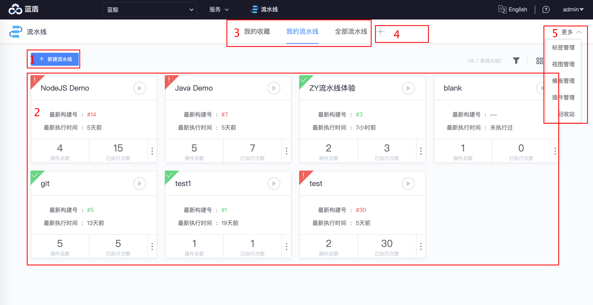

# 流水线列表查看页

你切换至流水线服务后的第一个页面就是流水线列表页，在这里你可以找到管理流水线需要的常见入口。

## 功能区介绍

1. 新建流水线
2. 查看流水线列表
3. 切换视图
4. 增加已有视图到流水线导航条
5. 流水线更多功能入口

## 接下来你可能需要

- [bk-ci导航条](../Console.md)
- [流水线编辑页](pipeline-edit.md)
- [流水线任务详情页](pipeline-detail.md)
