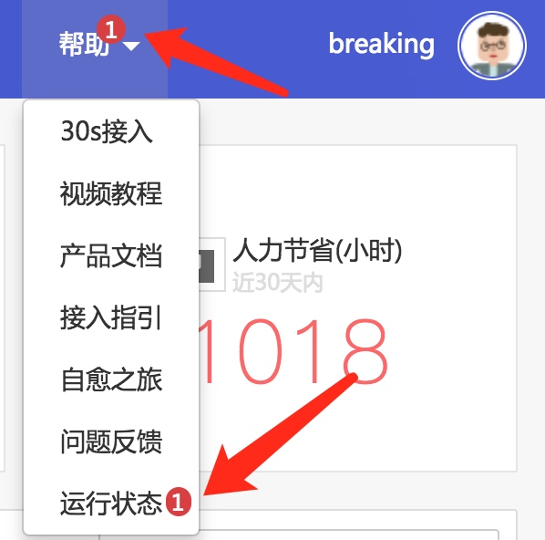

# 查看依赖组件运行状况

当故障自愈出现异常时，可以访问运行状态页面， 呈现故障自愈自身以及依赖的第 3 方组件的运行状态。

图 1. 故障自愈运行状态入口

> 或直接访问 URL：https://${PAAS_URL}/o/bk_fta_solutions/healthz/

以下是运行状态的部分截图

图 2. 运行状态效果

## 故障自愈异常时运行状态效果

当故障自愈自身或依赖的第 3 方组件异常时，会在帮助菜单上呈现异常指标(值为 false)的数量。

图 3. 异常时运行状态提示

以下是故障自愈依赖的组件异常时的效果

图 4. 异常时运行状态效果

