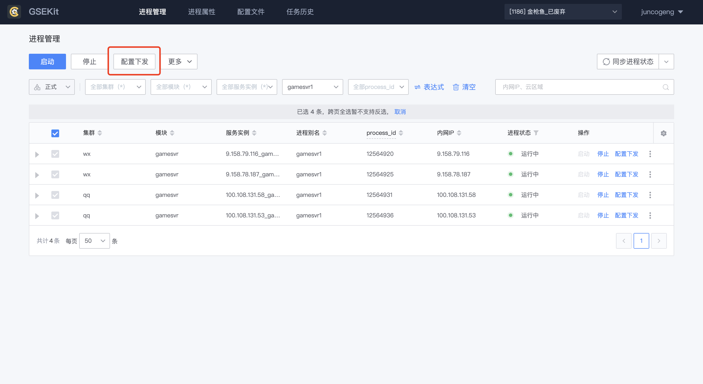

配置文件即进程的变量，进程在运行过程中根据变量，改变着自身的执行流程。

同一个进程之所以能够提供出不同的服务，直接由进程读取的配置文件中的变量决定，因而各服务的配置文件之间都存在着差异。

进程配置管理 提供了 配置模板 功能，并可将蓝鲸配置平台作为数据源，通过模板和变量的使用抹平差异，使得配置文件的管理的维护成本大大降低。

配置模板需要与进程进行绑定，方可进行配置下发操作。确立配置模板和进程的绑定关系后，配置文件下发的目标范围即为进程在业务中的部署范围。

### 定义配置模板

在 配置文件 Tab 页，点击 “新建” 按钮，在弹出的浮层中定义配置模板的基本属性

#### 字段释义

- 模板名称：
    配置模板名，用于区分不同的配置模板

- 文件名称：
    最终下发到目标主机上的文件名

- 文件绝对路径：
    最终下发到目标主机上的配置文件所处的绝对路径。注意这里是目录

- 文件拥有者：
    文件在目标机上所属的用户，如 root

- 文件用户组：
    文件在目标机上所属的用户组，如 root

- 文件权限：
    文件在目标机上完整的文件权限位，包括粘滞位权限（sticky）。如：0775

- 输出格式：
    文件的换行符格式，有两个选项可以选择
    LF - Unix and macOS（\n）
    CRLF - Windows（\r\n）

完成基础信息的定义后，点击 “下一步”，即可进行配置模板与进程的关系绑定。您也可以在稍候来进行这一步骤。

### 编写模板内容

在模板详情页面，点击 “新建版本”，进入配置模板编辑页面。您可以在配置模板中编写配置文件内容。
配置模板支持 mako 语法，并内置了配置平台变量，可以直接在模板内进行引用。

编写完成后，点击“预览”按钮，选择具体的进程实例，可即时查看配置模板在该进程实例上渲染完成后的配置文件内容。

确认没有问题后，可单击“保存”按钮存储此版本。

### 配置文件下发

只有状态为“正式”的版本，才可以执行下发动作。

在配置文件版本列表中找到刚刚保存的配置文件，单击“操作”栏的“配置下发”按钮，进入到配置文件下发流程中。

#### 选择实例

默认情况下，系统会拉取出当前配置模板关联的所有配置文件实例。
如需要指定配置文件下发的范围，可通过页面上方的过滤框进一步对下发范围进行过滤。

#### 配置生成

选择好配置下发的范围后，点击“下一步”，进入配置生成流程。
在这一流程中，系统会在后台完成即将进行下发的所有配置文件实例的渲染工作。待所有配置文件实例均生成成功后，“立即下发”按钮方可点击。

 

### 从进程视角下发配置文件

除了单独下发配置文件外，进程配置管理 支持一次性下发指定进程的多个配置。

在“进程管理”页面，选择需要下发配置的进程

筛选完成后全选进程，点击页面上方的“配置下发”按钮，系统则会拉取到当前进程绑定的所有配置文件。
待所有配置文件均成功生成后，即可一次性完成多个配置文件的下发。