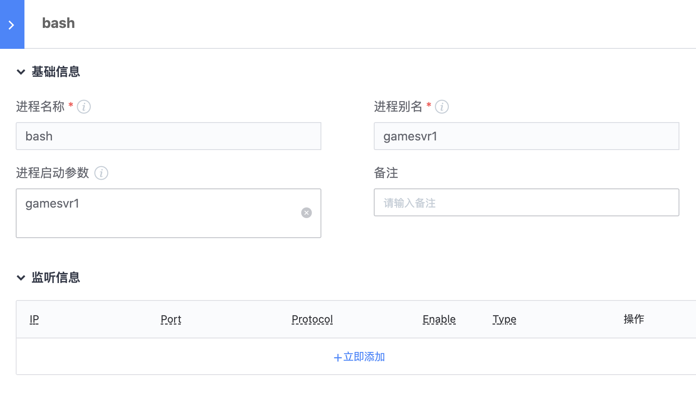

通过 进程配置管理，您可以进行进程的启动、停止等操作，并将业务进程托管注册至 GSE Agent。在进程异常退出时， GSE Agent 将会快速尝试拉起进程并发送告警知会相关负责人，尽可能降低对业务的影响。

您可以通过以下步骤，来将业务进程接入到 进程配置管理 中


### 一. 定义拓扑结构、环境类型

业务拓扑是进程、配置管控的基础，在使用 进程配置管理 之前，需要您在当前业务下已在 配置平台 定义好拓扑等基础信息


默认情况下，集群 是业务下的第一层级，分为 正式、体验、测试 三种不同的环境类型。进程配置管理 会基于环境类型，对操作进行严格区分。
因此，在定义好拓扑结构后，需要指定当前集群所属的环境类型。


### 二. 编写进程控制脚本

使用 进程配置管理 进行进程管控，至少需要以下两个脚本：

- 启动脚本（start）

- 停止脚本（stop）

以下脚本可根据业务实际情况决定是否编写，如果需要在 进程配置管理 内进行相应的操作，则必须配置相应的脚本

- 重启脚本（restart）

- 重载脚本（reload）

- 强制停止脚本（kill）

> 启动脚本需要在进程启动后，将进程的 pid 写入文件，并在 进程配置管理 中配置好 pid文件路径，否则 Gse agent 将无法监控进程状态

```bash
#!/bin/bash
# 启动脚本示例
 
cd /data/home/tools
./gamesvr > /dev/null &
 
# 获取进程的pid，并将pid文件写入指定文件内
sleep 3
echo $(ps xf | grep test_proc | grep -v grep | awk '{print $1}') > /data/home/gamesvr.pid

```

### 三. 定义进程

进程配置管理 需要进行管控的进程信息源自配置平台，接下来需要在配置平台中定义进程。

为方便日后的维护管理，推荐使用 服务模板 来定义进程
在配置平台中，选择要新增进程的模板，进入“模板详情”页面，点击“新建进程”。在“基础信息”栏中，填写以下参数



#### 字段释义

- 进程名称（监控使用）：
    真正执行的二进制名，如 zookeeper 的二进制名称是 java，则填 java
    可通过 readlink /proc/$(pid)/exe 来进行确认。GSE Agent 在检查进程状态时会校验此字段

- 进程别名（用户使用）：
    易于维护的服务名，如 zookeeper 的二进制名称为 java，此处可填写 zookeeper
    在 进程配置管理 进行进程操作时，通过此字段对进程进行筛选

- 进程启动参数：
    当同一主机上部署了多个 zookeeper 服务时，可通过此字段进行区分
    这里的参数并不会在启动时真正传递给程序，仅用来保证服务唯一性，区分进程

### 四. 完善进程控制信息

定义好进程后，需要完善一些基础的控制配置，方可让 进程配置管理 进行管控。


#### 字段释义

- 工作路径：
    执行进程启停等操作的脚本目录，即存放 start.sh、stop.sh 等脚本的目录

- PID文件路径：
    存放进程 pid 的文件路径，即 start.sh 脚本示例中的 /data/home/gamesvr.pid

- 启动用户：
    执行启动的用户名，用户名需在系统中真实存在

- 启动数量：
    进程启动的个数

- 启动优先级：
    进程启动的顺序，正整形数字。数值越大，越后启动，越先停止。
    若多个进程的优先级相同，则这批进程将同时被启动。

> 例如有三个进程，gateway、gamesvr、mysql，优先级分别为：1， 2， 3
> 启动时，启动顺序是 gateway -> gamesvr -> mysql
> 停止时，顺序则为 mysql -> gamesvr -> gateway
> 在启动和停止过程中，如果有任意一个进程操作失败，则任务整体应该立即终止，低优先级的进程不会继续操作
> 如，启动顺序是 gateway -> gamesvr -> mysql ，如果优先级高的 gateway 进程启动失败，则优先级低的 gamesvr、mysql进程均不会被继续启动

- 启动命令：
    执行“启动”操作时，实际执行的脚本

- 停止命令：
    执行“停止”操作时，实际执行的脚本

- 重启命令：
    执行“重启”操作时，实际执行的脚本

- 强制停止命令：
    执行“强制停止”操作时，实际执行的脚本

- 进程重载命令：
    执行“重载”操作时，实际执行的脚本

- 启动等待时长：
    进程在执行启动命令多久后，GSE Agent 再去探测进程的存活状态
    部分进程在启动时需要加载大量的数据，不会立刻启动完毕。如果在执行启动命令后立刻去探测进程状态，有可能会判定进程启动失败。
    如果指定“启动等待时长”为5，则 GSE Agent 会在执行启动命令5秒后，去检测进程是否启动成功

- 操作超时时长：
    执行操作命令的最长时间，超过此时间则判定操作超时


### 五. 同步服务模板

在服务模板中定义好进程，并完善其控制信息后，需要将模板中的信息“同步”至实例上。
在模板详情页面，“服务模板实例” Tab 页内，勾选列表中的所有实例，点击 “批量同步” 按钮即可完成同步操作


以上步骤均完成后，进入到 进程配置管理 即可获取到进程实例列表。

如未在实例列表中找到配置的进程，可通过“同步CMDB进程配置”按钮刷新缓存数据（正常情况下无需进行此操作）

至此，业务进程便完成了 进程配置管理 的接入工作，接下来您可以筛选进程，点击上方的操作按钮，对进程进行管控操作。