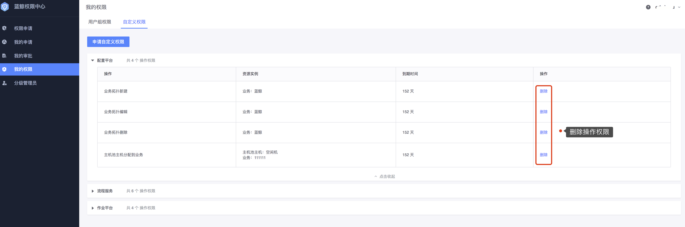

# 我的权限

**我的权限**页面展示个人拥有的所有权限，分**用户组权限**、**自定义权限**两部分权限展示。同一个操作权限可以同时在自定义权限和用户组权限里，删除其中一个来源无影响。

## 用户组权限

用户可以在**用户组权限**Tab 页进行申请新的用户组权限或者选择退出某个用户组。用户加入用户组的方式有两种：直接加入、通过组织加入。

- 直接加入：指用户直接被添加到某个用户组里，用户如不需要该组的权限 ，可以直接在**我的权限-用户组权限**里选择对应的用户组，点击**退出**。
- 通过组织加入：指用户所在的组织被添加到某个用户组里，用户如不需要该组的权限，无法直接退出，必须管理员将用户所在组织从该组里移除。

## 自定义权限

自定义权限是用户通过**自定义权限申请**而获得的权限，该方式并不是权限中心推荐使用，因为自定义权限太灵活，不方便后续权限的统一维护。

自定义权限按照系统分组聚合展示，用户可以在该页面继续申请自定义权限，或者删除部分权限，部分权限的删除包括**操作权限和实例权限**。

- **实例权限删除**：找到需要删除实例权限对应的操作，点击实例详情，在实例详情页里，点击**批量实例删除**可以进行实例权限的删除。

  

- **操作权限删除**：如不需要某个操作的权限 ，可以在权限列表里找到对应的操作权限，直接删除。

  