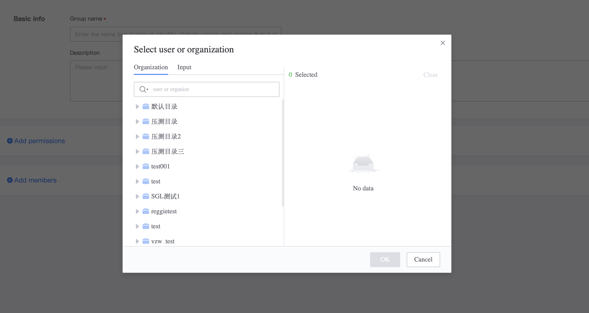
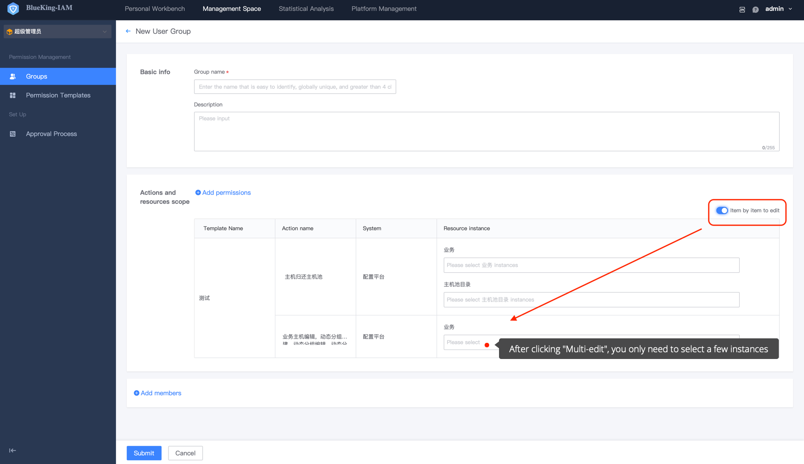
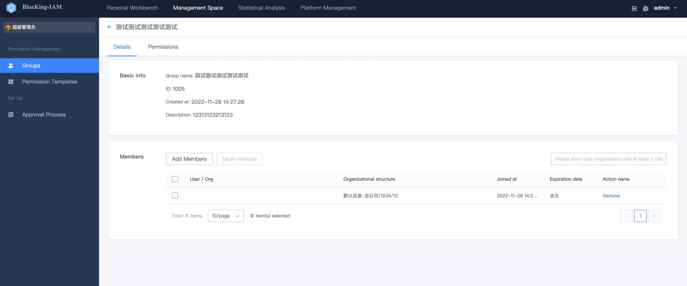
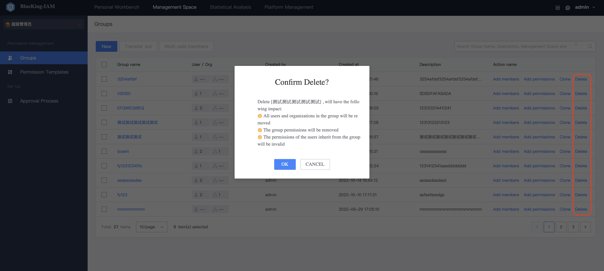

# UserGroup 

Create UserGroup is an administrator's ability [How to become a Super Administrator](../ProductFeatures/Manager.md),[How to become a System Administration](../ProductFeatures/Manager.md),[How to become a Grading Administrator](../ProductFeatures/GradingManager.md). 

## Precondition 

> 1. The user must true a grading administrator/super administrator/system administration

UserGroup is a permission management method **recommended** by BlueKing IAM. A UserGroup can append permissions to **multiple systems**. 

This chapter focuses on the create of UserGroup, UserGroup Members, UserGroup Authority Management and other functions.

## Add a UserGroup 

Click **UserGroup-Add** button (if you haven't create a permission template yet, you can create one first). 

 

 

- UserGroup Name: `Required`. 

- Description: `Required`, which clearly will the functions of the UserGroup, so that administrator or users can identify them when applying. 

- Add group member: `(Not required)`. Group members include user and organizations. IAM provided two methods add member: organization architecture topology selection and fmanual input (manual input only supports user addition). Members can also be added directly by finding the corresponding UserGroup in the UserGroup list. 

 

- Add group permission: `(Not required)`. Select permission template or customize permission. 

 
  
After selecting a template or customize permission, you need to link of specific resources instance. Select a resource instance and click **submit** complete a UserGroup. 

  

## Edit UserGroup 

Edit a UserGroup involves changes of group basicInfo, UserGroup permission, and members.

 

- Edit a UserGroup involves changes of group basicInfo, UserGroup permission, and members.

- Group member editing: UserGroup members can be deleted or added.

- Edit group permission: Switch to the **Group Permissions** Tab page to append or delete instance permissions.

## Delete a UserGroup 

In the UserGroup list, you can directly for a UserGroup. Deleting a UserGroup will remove the users and permissions in the group. Please operate with caution.

