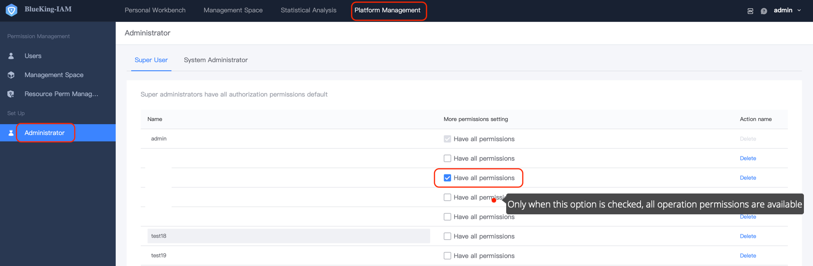
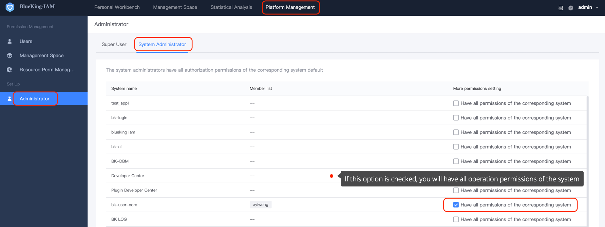

# Administrator Setting
> This article describes how to setting Super Administrator and System Administrator.

- Super Administrator setting: you need the identity of `Super Administrator` to setting and manage super administrator members.
- System Administrator setting: `Super administrator` can set system administrators of all systems. System administrators can only set system administrator members of the current system.

([How to become a Super Administrator](../ProductFeatures/Manager.md),[How to become a System Administrator](../ProductFeatures/Manager.md))

## Super Administrator Setting
By default, the super administrator only has all the authorization permissions of all the connected systems. You can check `Have all the Operation permissions of BlueKing` to enable the corresponding super administrator to have all the operation permissions at the same time.

## System Administrator Setting
Super Administrator can setting all System Administrator.

If you are a System Administrator, you only have the authorization permission of the corresponding system. You can check `Have all operation permissions of the system` to enable the corresponding system administrator to have all operation permissions of the system at the same time.

