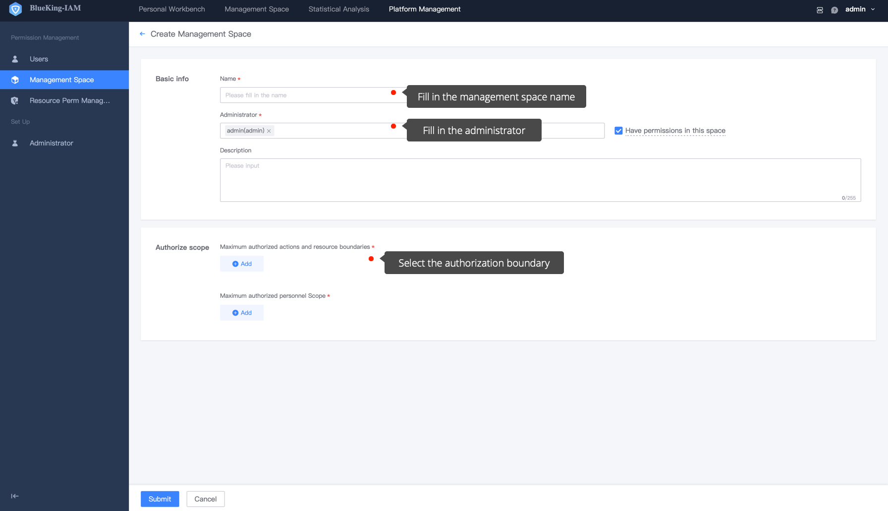
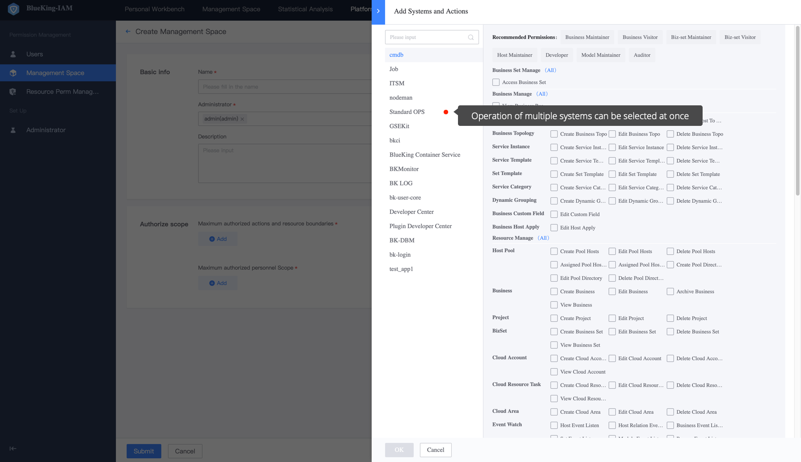

 # Super Administrator Create Administrator Space

 To have a Super Administrator [How to become a Super Administrator](../Feature/Manager.md) login to BKIAM,  enter **Platform Management-Grading Administrator** page, and click `add` to create a grading management space. 

  

 ## Basic Information

 - Name: Different Manage spaces are distinguished and named according to the demand scene, which can be revise at any time. 
 - Administrator: By default, an administrator only has the authorization permissions under the space, but not the operation permission of the resources itself. If you need the operation permission of the resource, you can check **Both operation permission and resource permission under the space** on the right. 
 - Description: Describe the function of the manage space.

  

 ## Maximum Grantable Operation and Resources Boundaries

 **Maximum authorized operation and resources boundary** represents the **maximum authorized permission range** of Manage space. Multiple operations can be select across system. 

  

 After choosing an operation, you need to select the corresponding instance range for each operation. For instance selection, you can select a specific instance or select a dynamic instance approve attribute conditions.

 > For example, if operation a of system A is select, and the corresponding instances are i1, i2, and i3,  grading administrator can only grant permission to other people in the instances i1, i2, and i3 of operation A.

  

 ## Maximum Authorized Personnel Boundary

 **Maximum Authorized Personnel Boundary** represents the maximum scope of personnel that can be `authorized` in Manage space. Only users within the scope of authorized personnel can see the UserGroup create in the corresponding management space. This two-way Limit avoids interference from unnecessary auth and leakage of sensitive permissions. Personnel can be organizations or specific users. 

 > For example, if you choose `Organization: Guangdong Branch, user: user`, manage space can only authorize these two types of people, and only they can see the UserGroup create the corresponding management space to apply to join. 

  

 After selecting the operation instance and personnel range, click `submit` to finish the create of the manage space. 

 ## Switching to Manage Space for Authorization 

 After the manage space is created, you can switch to the corresponding management space to perform related operation.
 
  