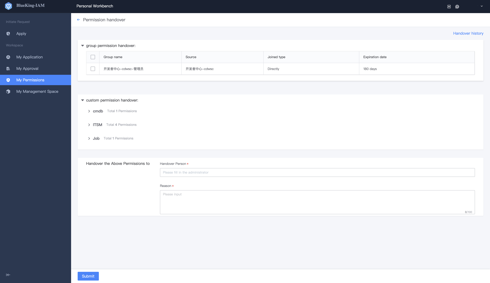

# Transfer of Permission

When a user needs to transfer or resign, BKIAM provides the **One-Click Transfer** permission function, and users can complete permission transfer scenarios as needed. 

In the **My Permission** menu page, click **Permission Transfer** to enter the transfer page, check the permission to be transferred, and click **Submit** to complete the transfer. After the transfer, the corresponding permission will no longer be owned. 

