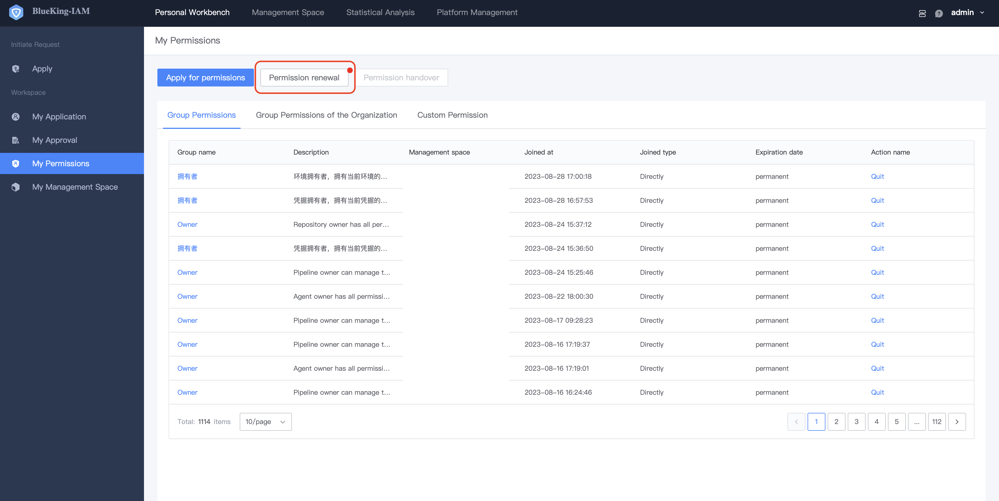
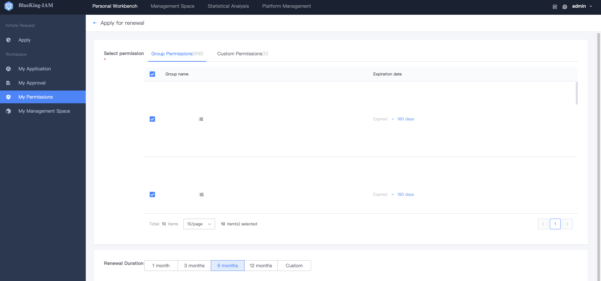

# Renewal of Permission

When a user's permission is about to expire, BKIAM automatically sends a renewal email to the corresponding user. The user can renew the permission by one click through the email or process the renewal operation in BKIAM.

On the **My Permissions** menu page, if there is a permission for the user to renew, a red dot will appear on the **Batch Renewal** button for the user to click. Click **Batch Renewal** to enter the renewal project operation page, select the permission to be renewed, and click **Submit** to renew it. The renewal operation requires the same approval process as the application permission. After the approval process is passed, the validity period of the permission will be automatically extended. 

