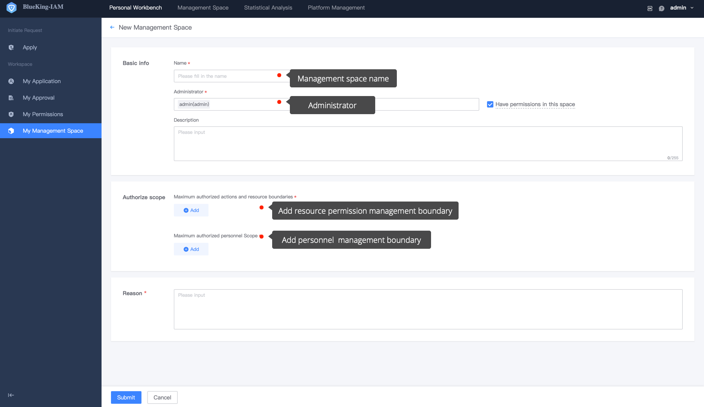
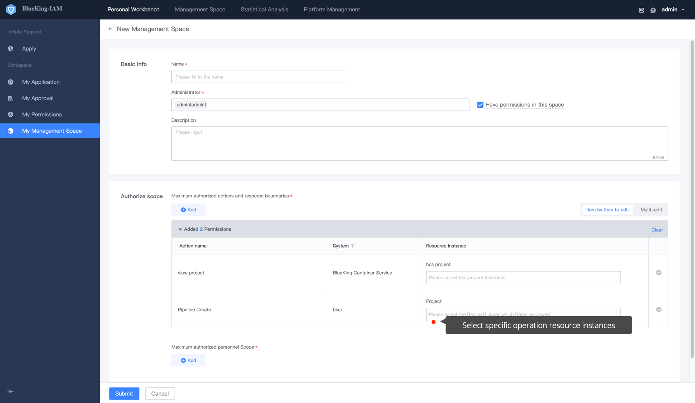
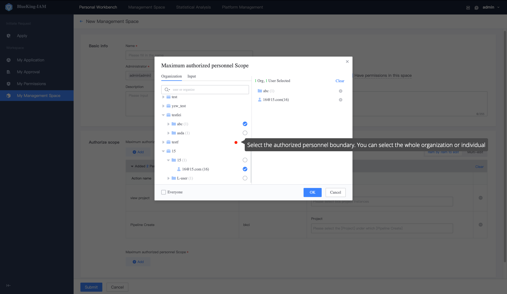

 # Normal Users Apply to Create Manage space

 Log in to BlueKing, open BKIAM, and enter the management space list page under **Personal Workbench-My Manage Space** menu, where the list of personal management spaces is displayed. 

  Click **Application add** to create manage space.

  

 Fill in the basic information, and choose the **Boundary** of the manage resources permission and authorized personnel. 

  

 ## Basic Information

 - Name: Different Manage spaces are distinguished and named according to the demand scene, which can be revise at any time.
 - Administrator: By default, an administrator only has the authorization permission under the space, but not the operation permission of the resources itself. If you need the operation permission of the resource, you can check **Both operation permission and resource permission under the space** on the right. 
 - Description: Describe the function of the manage space. 

 ## Maximum Grantable Operation and Resources Boundaries

  **Maximum authorized operation and resources boundary** represents the **Maximum authorized permission range** of Manage Space. Multiple operations can be select across system.

  

 After choosing an operation, you need to select the corresponding instance range for each operation. For instance selection, you can select a specific instance or select a dynamic instance approve attribute conditions.

 > For example, if an operation of system A is selected, and the corresponding instances are i1, i2, and i3, The grading administrator can only grant permission to other People in the instances i1, i2, and i3 of operation A.

  

 ## Maximum Authorized Personnel Boundaries 

  **Maximum Authorized Personnel Boundary** represents the maximum scope of personnel that can be `authorized` in Manage Space. Only users within the scope of authorized personnel can see the UserGroup created in the corresponding management space. This two-way Limitation avoids interference from unnecessary auth and leakage of sensitive permissions. Personnel can be organizations or specific users. 

 > For example, if you choose `Organization: Guangdong Branch, user: user`, The Manage Space can only authorize these two types of people, and only they can see the UserGroup create the corresponding management space apply to join.

  

 After selecting an operation instance and a personnel range, click `submit` to finish the apply for creating a manage space. The application for creating a management space requires approval. After Approved, you can check in the My Management Space List.  