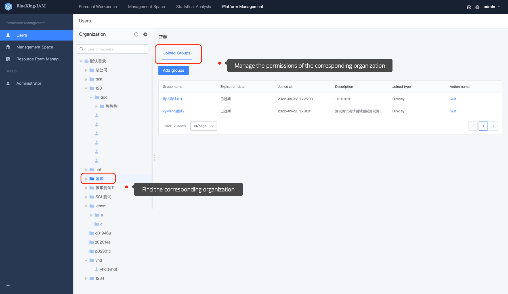

 # User/Organization 

 Organization architecture Manager is currently a Super Administrator ([How to become a Super Administrator](../ProductFeatures/Manager.md)). 

 ## Precondition 

 > 1. User is Super Administrator

  By default, BKIAM synchronizes the personal and organizational information managed by BlueKing users in the form of organizational architecture, so that the administrator can manage permissions in the **Person** and **Organization** dimensions. 

 In the **User** menu, you can view and manage the permissions of a person or an organization. 

  

 ## Manage User Permission 

 Click the **User** menu to search for the **User** who needs management permission. After selecting a specific user, you can delete its permission. 

  

 ## Manage Organization Permission

  Enter the User menu, search for the **Organization** that requires management permission. After selecting a specific organization, you can delete its permission. 

  