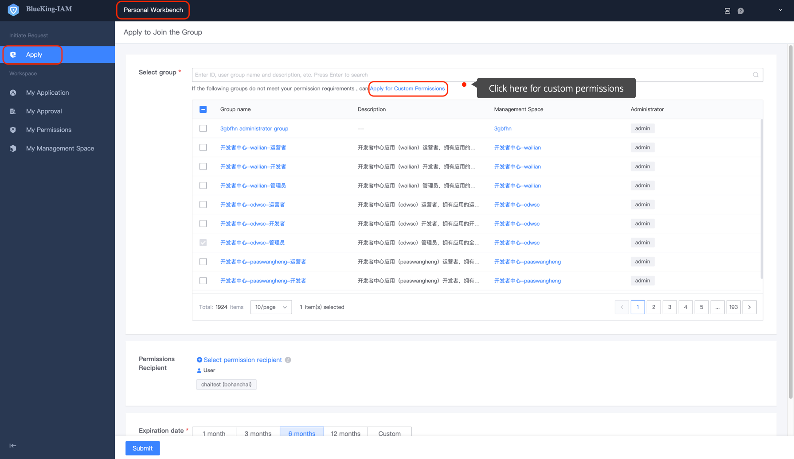
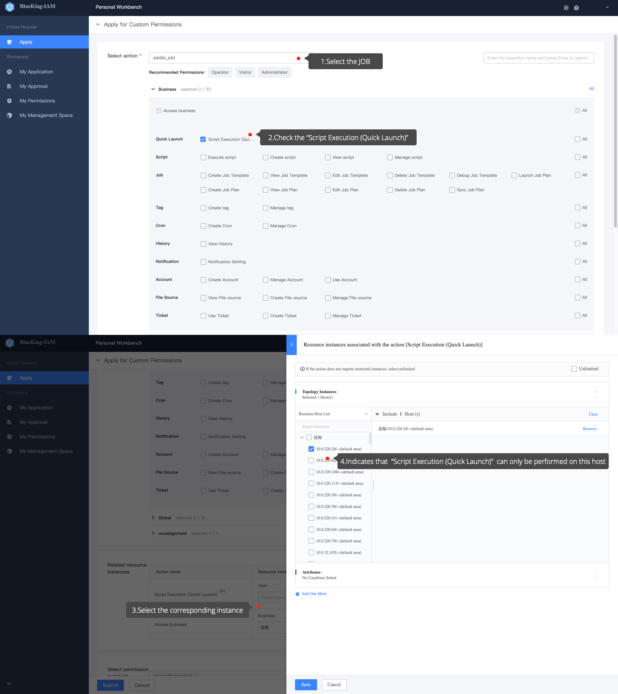
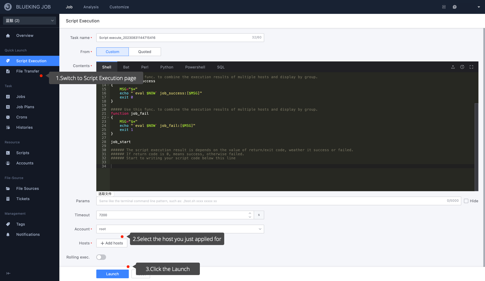
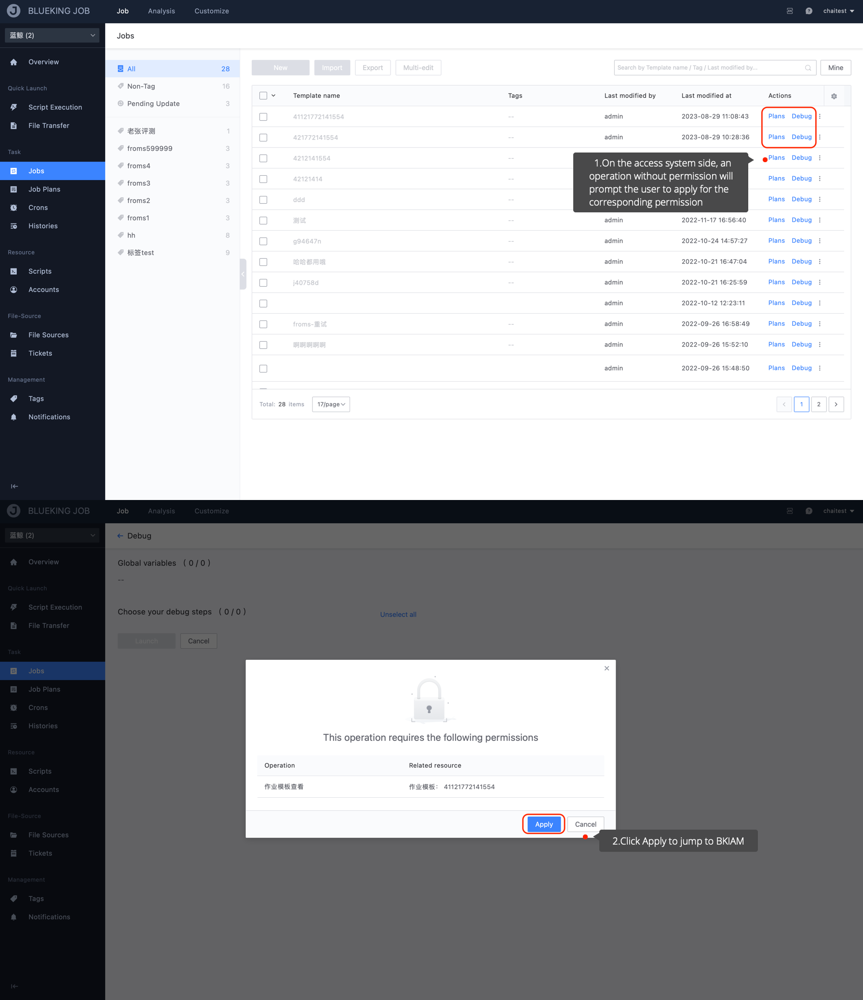

# Apply for Customized Permission

## Precondition 

> None 

BKIAM **Recommended** manages permissions uniformly through UserGroup. If there is no suitable existing UserGroup or the required permissions are simple, you can apply for customized permissions. This chapter describes how to apply for customized permissions using the **Job** permissions as an example.

Customized permission application entry, which can be accessed from **Custom Permission Application** or **No Permission from the Access System Side**.

## Customized Permission Application Entry

## Steps

1. Click on the **Permission Application** menu to display the permission application page. 

    

2. Click **Apply for Customized Permission - Apply Now** to display the customized permissions application page, and then select **System, Operation and Resources Instance** to save. 

    

3. Click **Submit** and wait for the approver's approval. After approval, you can view the customized permission you just applied for on the **My Permissions** page. 

    
   
4. Open **Job**, go to the **Execute Script** page, select the host you applied for, and click `Execute'. Since you have applied for permission, the script can be executed successfully here. 

    

## Jump from the Access System Side Without Permission 

## Steps

1. If the user directly accesses the access system page, the access system will prompt the user that the user has no permission and apply for the required operation permission.

    

2. Click **Apply** to be automatically directed to BKIAM, where the required operation and instance permissions will be automatically applied. Users can complete the permission application by clicking submit. 

   