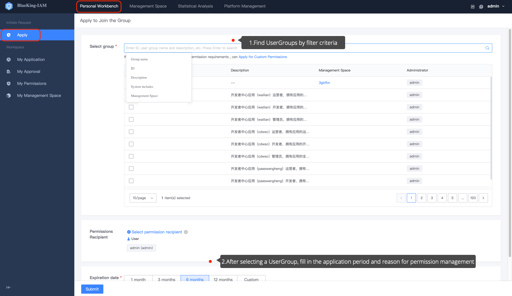
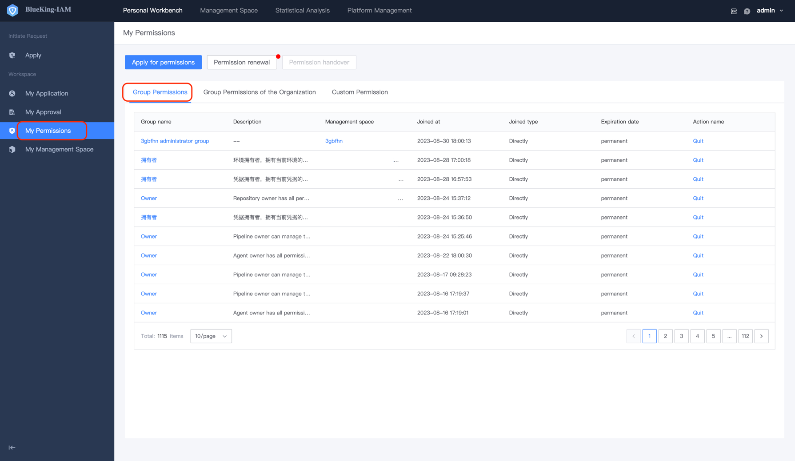

# Apply to Join a UserGroup

## Precondition 

> There are already created UserGroup.

# Steps 

1. Enter the **Personal Workbench** menu to access the **Permission Application** page.

2. Find the required UserGroup by filtering conditions, and fill in the application period and reason to apply for UserGroup permission.

3. Click **Submit** and wait for the approver's approval. After approval, you can view the UserGroup you just applied for on the **My Permissions** page.

