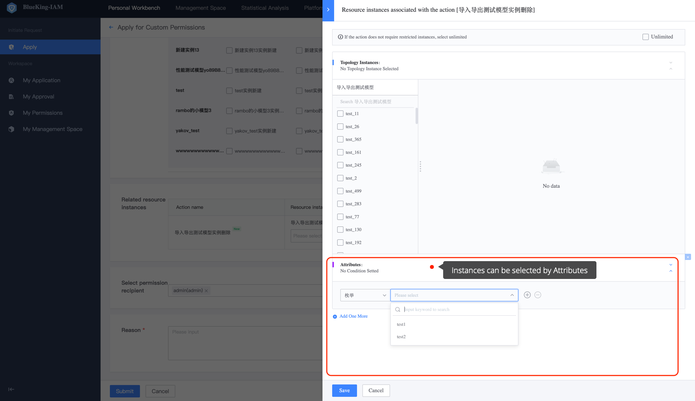
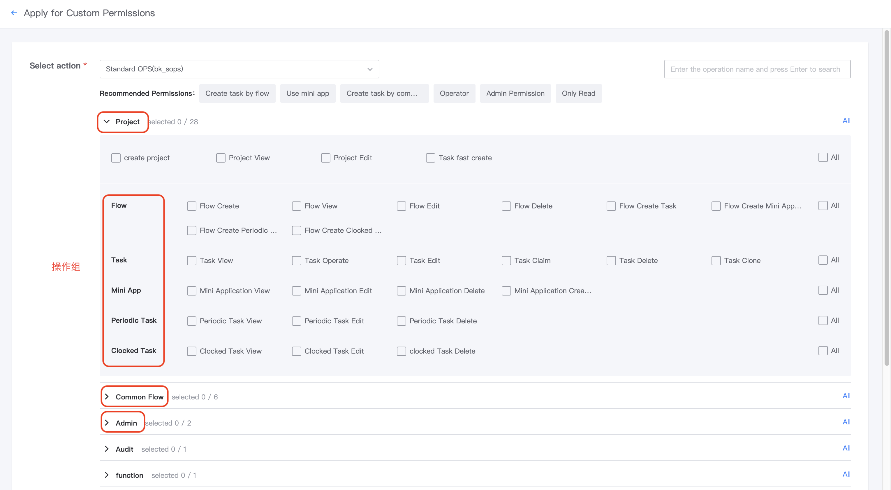

# Term
Before using BKIAM, you should quickly understand some basic terminology concepts.

## System
All major platforms or SaaS within the BlueKing system, non-BlueKing framework applications must be registered as BlueKing SaaS in the BlueKing Developer Center.

## Operation
Access to a specific scene function in the system that requires permission control, such as add job, host transfer, menu view, etc. An operation is preferably a minimal atomic function, and the operation should be **Enumerable and Relatively Static**. The number of operations in a system may increase as the system function module increases, but generally will not increase indefinitely over time.

## Resource Type
**Resource**, for short, refers to the object associated with the **Operation** that requires auth control on each system. For example, **Job Add** is associated with **Job**, **Host Transfer** is associated with **Host**, and so on. Job and Host are both **Resource Type**.

## Resource Instance
A resource instance is a specific instantiated object of a resource type and the minimum granularity of permission control, such as a specific **Job**, **Host**, etc. In general, a resource instance is **Dynamic** and grows linearly over time.
## Instance View
The access system can customize "Register" multiple instance views with IAM according to its own business name scene. An instance view represents a select method of instances. When applying for permission to link resources instances, the user can switch between different **Instance Views** to select instance permissions.

## Resources Attribute
The **Resource Attribute** is a way for BKIAM to filter resource instances to match the scene that requires dynamic permissions.

## Add Associated Permission
To make it easier for users to obtain permissions, BKIAM provides the ability to add associated permissions. When you request to create resources, you can **Also Obtain** other operations permissions to create resource instances. For example, if a user applies to **Add Job** permission, you will automatically receive **Delete, Edit, and View** permissions for the job when you create it. There is no need to apply twice.

## Dependent Operations
When the permission operation is applied by the user, it must depend on some other pre-operation permissions. For example, if the user requests to **Edit Job**, the **Job View** operation permission must be relied upon. Job Viewing is the dependent operation of Job Editing. The user does not need to worry about the dependent operation. BKIAM handles the dependent logic automatically. The user can go directly to the target and select the required permission.

## Dependent Resources
In BKIAM, the access system registers `Operation` and `Resource` respectively, and must also register the link relationship between the operation and the resource. The resources associated with an operation are called resources of the operation, and the dependent resource must be indispensable for the operation. For an activity, the dispensable resource is not the dependent resource. An activity can have no dependent resource or multiple dependent resources. The registration order of multiple resources is consistent with the front-end presentation and authentication order.

> For example, the dependent resources for the Job Execute operation are jobs, host, and account because these three resources are required to execute a job, but script is not a dependent resource because a job cannot have a script step.

The dependent resources of most operations include the target resource, but there are cases where the dependent resources are superior resources.

> For example, the dependent resource of Job Execute is the job itself, but the dependent resource Job Add is its superior resource business, because the job can only select objects created under a specific business.

## Operation Groups 

Operation groups are used to access the system. Operations in the same scene are classified into task groups according to the usage habits of the system, so that users/administrators can control task permissions in the AccessCenter. The operation group is only used to optimize the experience when the front-end selects the operation, and does not affect the underlying logic.

> > For example, JOB has several operations: `run job`, `delete job`, `run script`, `view script`, `add IP whitelist`, and `manage global settings`. 

With the addition of the operation group, the front-end looks like this:
 

The operation group name, operation group, and the order of elements in the group are defined by each access system. Currently, BKIAM supports the `two-level operation group' set.

**Important!!!!** 

Each access system can define 0 (no service classification required), level 1, and level 2 operation groups as needed. Operations can `be classified by resource type` or `be classified by user usage scene`. An operation can only belong to one operation group and cannot overlap.

## Version 
BKIAM provides `version` support for the resources and operations registered by the access system. Version is only used to distinguish between old and new resources and operations on the system access page. 

## Permission Template
A permission template is a collection of operations. A permission template represents the scene permissions required by a position role, such as operations and maintenance, development, and test. A template can contain only one system operation.

## UserGroup 
UserGroup is a permission method recommended by BKIAM. A UserGroup can be associated with multiple privilege templates on multiple systems to obtain appropriate privileges. Administrators need only append **User/Organization** to the UserGroup to obtain the appropriate user group privileges. 

## Customized Permissions
In addition to managing user permissions and approving UserGroups, BKIAM also supports a more flexible methods: Customized permission. Users can select any operation and instance as the permission they need in their scene. Because of the flexibility of the permission, it is not as easy to manage as UserGroup. So please use it with care to avoid confusion in later permissions. Currently, 1 person has **1 Operation + 1 Resource Type** instance permissions with a **Maximum** amount of 10000. 

## Grading Administrator
Grading Administrator is a custom permission in BKIAM. After becoming a grading administrator, you can assign appropriate resource permissions to other users.