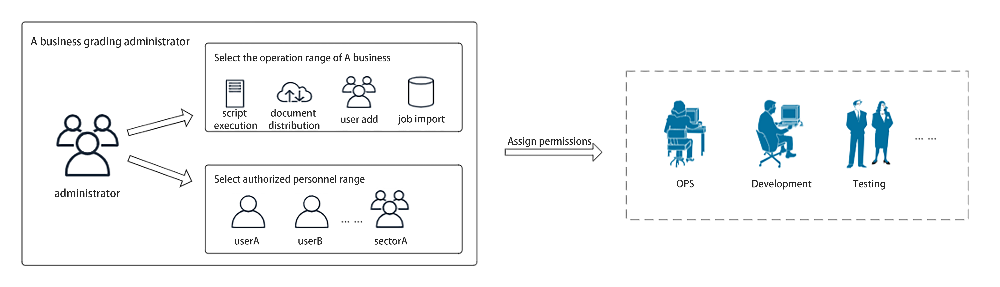
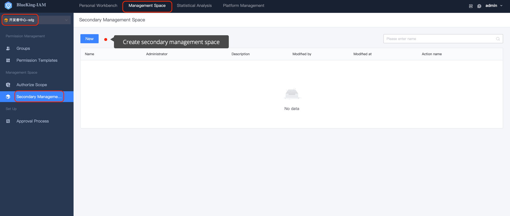

 # Grading Permissions (Management Space)

 ## Scene Description 

An enterprise has multiple Business Name, and each business has a dedicated business leader to manage permission. For example, the business leader of Business A needs to assign corresponding business access permissions to developers, product personnel, and testers.

 ## Solution 

 BKIAM provided a grading permissions solution. Grading administrator are expressed approve [Management Space](../Feature/GradingManager.md), which is created by super administrators or business leader themselves. After becoming the administrator of the corresponding Manage space, you can manage the auth under the space independently. 

  

 - Create by [Super Administrator](../Feature/ManagerCreate.md), or A business leader [Apply to Create Grading Administrator](../Feature/UserApply.md) 

   

   

 - After the Manage space is create, switch to the corresponding management space approve the navigation menu for permissions. 

   

 - Click the **UserGroup** menu to Created user groups for **OPS**, **Develop** and **Test** respectively, and grant different permission to the corresponding UserGroups. At the same time, append the corresponding users to finish the authorization. 

   

 - BKIAM also supports two-level Manage space, that is, you can created your own sub-management space under each management space to **Implement further detailed management of permissions**. 
 
   