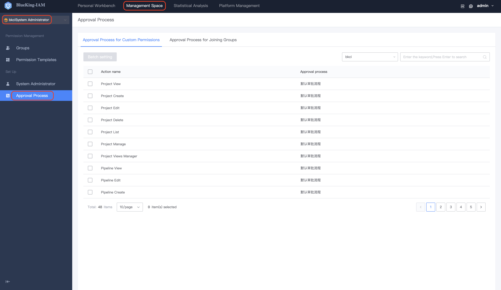

# Approval Process Setting 

Approval process setting divided minutes `create and link` of approval process.`Create` of approval process will be exist [Process Service Management (ITSM)](https://bk.tencent.com/docs/document/6.0/145/6623), accessCenter only needs to support `link` setting of Approval process. 

## Creation of Approval Process 

1. Enter [Process Service Management](https://bk.tencent.com/docs/document/6.0/145/6623) and access the **project-service** menu. Search for **Default Approval Process**, and click **Clone** to clone the existing approval process for editing.

   

2. After entering the flow edit page, drag and drop the required nodes to perform the arrangement.

   

3. Click the new node to edit, fill in the **Node Name** and **Node Processor**, and confirm and save to complete the creation of the approval process.

   

## Approval Process Linking 

After the approval process is created in ITSM, the approval process can be linked in IAM. Different roles can have different settings.
- Super Administrator: You can set the `Operation Permission` of all systems and the approval process link of `UserGroup` created by members of the super administrator.
- System Administrator: You can set the `Operation Permission` of the corresponding system and the approval process link of the `UserGroup` created by the corresponding system administrator member.
- Grading Administrator: Can set the approval process link of `UserGroup` within their jurisdiction.
Different approval scenes will automatically filter the approval process of the corresponding approval role:

Customize Permission Approval Process: Can be linked to **approval processes that do not (include)** `Grading Administrator`.

Approval process for joining UserGroup: **Approval process (include)** `System Administrator` can be linked.

To create a rating administrator approval process: it can be linked **approval process that do not (include)** `System Administrator` and `Grading Administrator`.

### Super Administrator Approval Process Setting

The super administrator can set the global default approval process and personalized approval process of the corresponding approval scene.

The global default approval process scene includes: approval scene including customize auth, joining UserGroup, and creating grading administrator.

Personalized approval process scene include: customize permission approval process and UserGroup approval process.

Customize permission approval process: the super administrator can set the approval process for **all** custom permission application.

Approval process for joining UserGroup: the super administrator can set the approval process for **all** UserGroup.

### System Administrator Approval Process Setting

The system administrator can set the personalized approval process of the corresponding approval scene.

Personalized approval process scene includes: customize permission approval process and UserGroup approval process.

Customize permission approval process: the system administrator can only set the approval process for custom permission applications belonging to **the system**.

Approval process for joining UserGroup: the system administrator can only set the approval process for the UserGroup belonging to **this system**.

### Grading Administrator Approval Process Setting

The grading administrator can set the personalized approval process of the corresponding approval scene.

Personalized approval process scene includes: join the UserGroup approval process.

Approval process for joining UserGroup: the grading administrator can only set the approval process for UserGroup created by the **grading administrator**.

