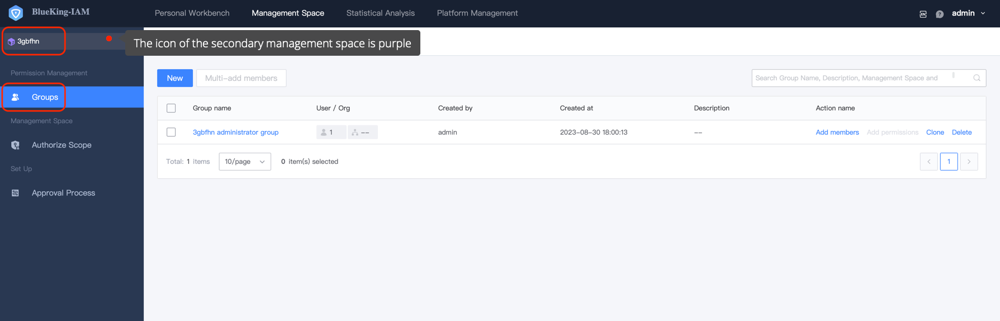

 # Secondary Manage Space 

 In order to support finer-grained Permissions capability, the accessCenter provided a secondary management space capability, that is, under the management space, a sub-management space can be create to further refine permission management. 

  

 To Created a secondary Manage space, you need to switch to a management space, click **add**, Fill In the Basic Information and definition the authorization boundary to create a secondary management space. 

  

 Complete create, you can view the secondary management space created by the current management space under the **Secondary Management Space** menu under the Manage space. click Right **Enter Space** on the right to switch to the corresponding secondary management space. 

  

  

 In the secondary Manage space, we can also Created userGroup for authorization Operation. 