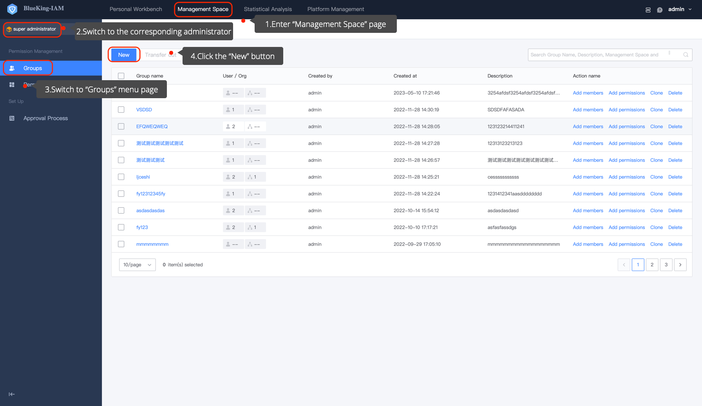

# Create a UserGroup

BKIAM **Recommend** managing permissions through UserGroup. You can link permission templates to authorize a UserGroup. Then, by adding users or organizations to a UserGroup, these users or organizations will automatically have the permissions of the UserGroup. The UserGroup is created by an Administrator ([How to become a Super Administrator](../ProductFeatures/Manager.md), [How to become an System Administrator](../ProductFeatures/Manager.md), [How to become a Grading Administrator](../ProductFeatures/GradingManager.md)).

## Preconditions

> 1. The logged-in user must have an administrator role (Super Administrator, System Administrator, Grading Administrator).

> 2. Create permission template (optional)

## Steps
1. Go to the **Permissions Management** page, switch to the corresponding administrator, click the "UserGroup" menu page and click on the "Add" button.

   

2. On the Add UserGroup page, fill in the appropriate information.

   
   - UserGroup Name: `Required`, which can be changed at any time.
   - Description: `Required`, which clearly describes the functions of the UserGroup, so that administrators or users can identify it when applying.
   - Add Group Member: `(Not required)`. Group members include users and organizations.  This means that the corresponding members are assigned the permissions of the group.
   - Add Group Permission: `(Not required)`. Add the created [permission template](./CreatePermissionTemplates.md) to the group permission or add customize permissions directly to grant permissions to the group.

   