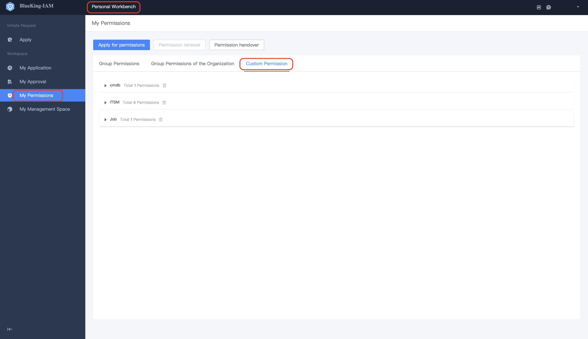
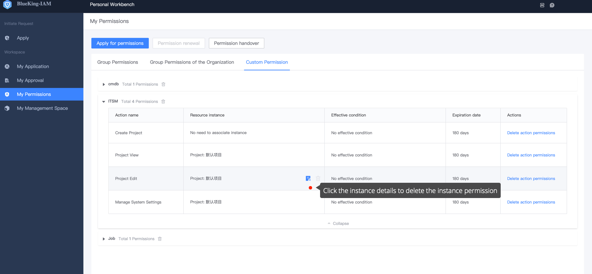
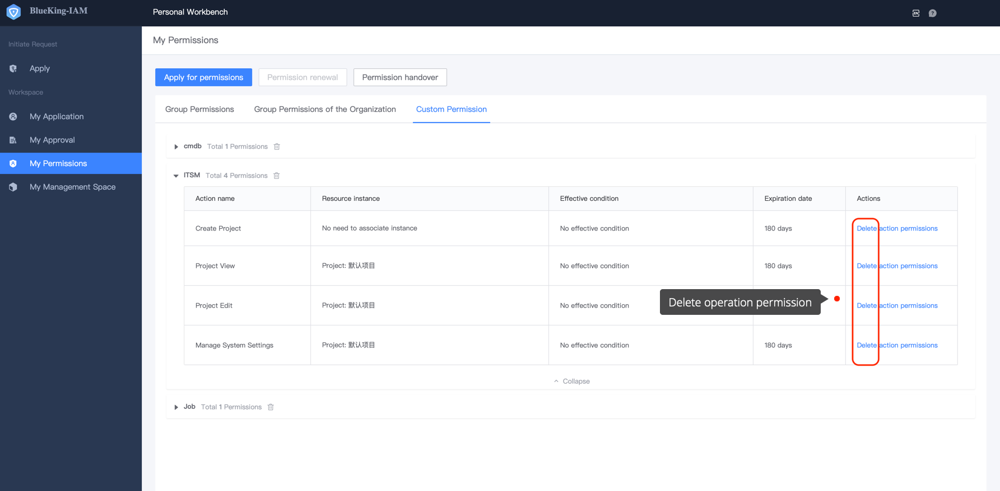

# My Permissions 

The **My Permissions** page displays all the permissions owned by an individual, which are divided into two parts: **UserGroup Permissions** and **Customize Permissions**. The same operation permissions can exist both customize permission and UserGroup permission. Deleting one of the source has no effect.

## UserGroup Permissions

User can apply new UserGroup permissions or choose to exit a UserGroup on the UserGroup Permissions tab page. There Have two ways to join a UserGroup:Join directly or through an organization.

- Directly join: Means that a user be directly added to a UserGroup. If the user does not need the permission of the group, he/she can directly select the corresponding UserGroup in **My Permissions-UserGroup Permission**, and click **Logout**.
- Join by organization: The organization of the user is added to a UserGroup. If the user does not need the permission of the group, he/she cannot exit directly. The administrator must remove the organization of the user from the group. 

## Customized Permissions

Customized permission is the permission obtained through **Customized Permission Application**. This method is not recommended by BKIAM, because customized permission is too flexible and inconvenient for unified maintenance of subsequent permissions. 

Customized permissions are displayed by system grouping and aggregation. Users can continue to apply for customized permissions on this page, or delete some permissions, including **Operation permissions and instance permissions**. 

- **Delete instance permission**: Find the operation corresponding to the instance permission to be deleted, click instance details, and then click **Delete instance in batch** to delete the instance permission. 

 

- **Delete operation permission**: If you do not need the permission of an operation, you can find the corresponding operation permission in the permission list and delete it directly

 