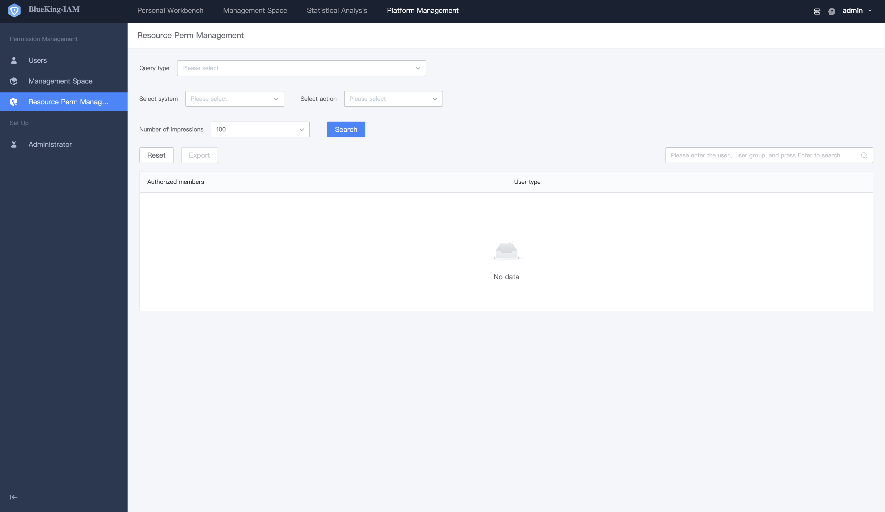
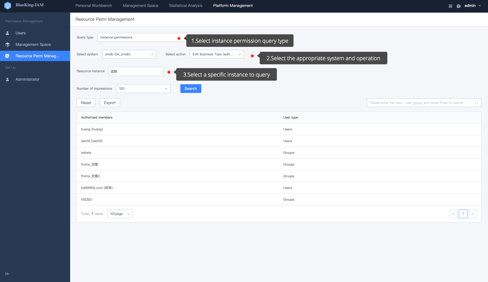

# Resource Permission Management

## Precondition 

> 1. User must be a super administrator 
> 2. Switch to administrator 

**Resources Permission Management** is one feature that enables you to perform reverse query on the corresponding user or UserGroup with permission approve **Operation** or **Instance**. The user can switch to the super administrator status and enter the **Resource Permission Management** menu page. 

 

## Querying the List of User or UserGroup with Permission for a Certain Operation

If you only want to find of user or UserGroup with a certain operation permission, you can approve the **Operation Permission** type to find them. This method is generally applicable to operations without linked resource type or some sensitive operations. 

 

## Querying the List of User or UserGroup of Permission for a Resources Instance

If you need to query the users or UserGroup who have permission to own a resources instance, you can find them by **Instance Permission** type.

 

Find a user or UserGroup with permission. You can combine [User](./Users.md) to manage user permissions.