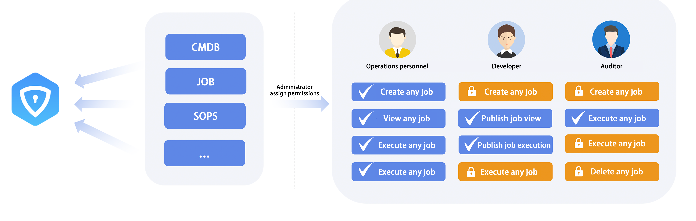

 # Overview 

 BKIAM is a centralized permission management service provided by BlueKing, which supports permission control access of SaaS and enterprise third-party systems based on BlueKing development framework, as well as fine-grained permission management.
 # Permission Centralized Access

 All platforms or SaaS of BlueKing have been integrated into IAM. Enterprises can use it out of the box. Third-party system or SaaS developed on BlueKing can also be quickly connected to the IAM. For details see [System Access Development Guide](.././.././iam_dev_docs/QuickStart/01-Begin.md) 

  

 ## Fine-grained Permission Management

 Administrator can assign permissions for specific instances to people in different positions, making permissions more flexible. 

  