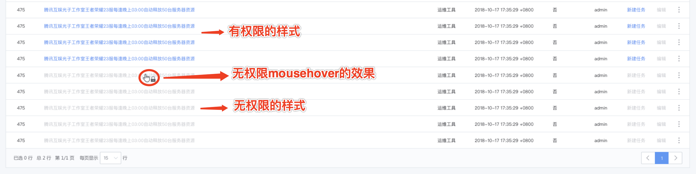
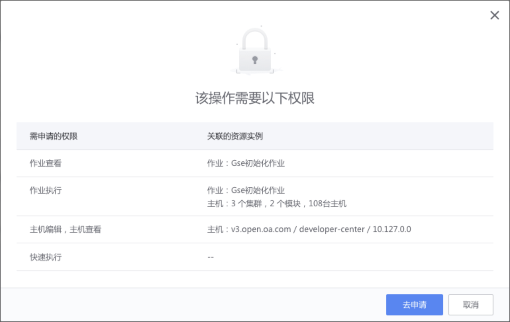
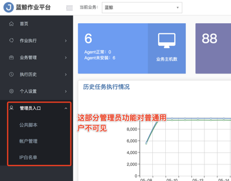

# 无权限交互方案

## 无权限交互说明

1、无权限校验尽量**事前校验**（用户点击资源操作前就提示有无权限），其次才事后校验（用户点击后才提示有无权限）。设计稿如下：

2、权限中心提供 api 和页面跳转方式支持无权限的交互，两种交互都需要系统提供具体的无权限的资源、资源实例、需要用户申请的权限。

- 系统内资源无权限时，交互如下。

- 系统间调用无权限时（比如标准运维调作业平台），底层系统需要提供具体无权限数据（被调用系统、无权限的资源/资源实例、无权限的操作）给上层调用方系统，调用方系统进行无权限交互展示，用户点击交互如下。

3、无权限时去权限中心申请，需在**新标签页中打开权限中心的跳转链接**，不在本地打开，否则会打断当前页面的操作。

4、如果是在已有弹窗的交互上提示无权限，采用**二次遮罩效果（再弹窗）**处理。

5、用户拥有某个系统的业务权限，不代表在其他系统拥有相同的业务权限。比如用户在配置平台可以看到 10 个业务，但是在作业平台可能看不到任何业务。

6、普通用户进入系统页面无任何权限时，整个页面提示用户**暂无任何权限**，用户只需要**申请指定资源所属下任何一个资源的任何一个操作权限**，审批通过后，可以查看具体系统页面。考虑到用户体验，系统可以根据自己的访问逻辑引导用户申请具体的初始权限。

7、用户点击「去申请」后，新窗口打开权限中心页面，将无权限相关数据传递给权限中心，权限中心参考「自定义申请页面交互样式」的基础上，需要让用户感知到新实例/新权限。

8、用户点击「去申请」后，SaaS 侧需要关闭当前弹窗，同时弹出「刷新页面」提醒。

## 无权限交互展示方案

- 方案一场景：

当资源操作为角色/岗位类功能时，比如管理员页面，不给用户展示，表示的是这类资源操作非人人都可用 ，用户只能通过权限申请或者管理员授权获得相应的权限，这类资源操作对用户直接隐藏。

> 注：普通用户通过链接访问无权限功能页面时，需提示用户无权限，交互设计如下。

- 方案二场景：

当资源操作为具体细节功能点时，比如作业的新建、编辑、删除，表示的是这类资源操作 人人都可用 ，只是有无权限的区别，用户可以通过点击无权限的资源操作去申请具体的权限，这类资源操作对用户在显示样式上置灰处理，表示无权限访问该资源。
