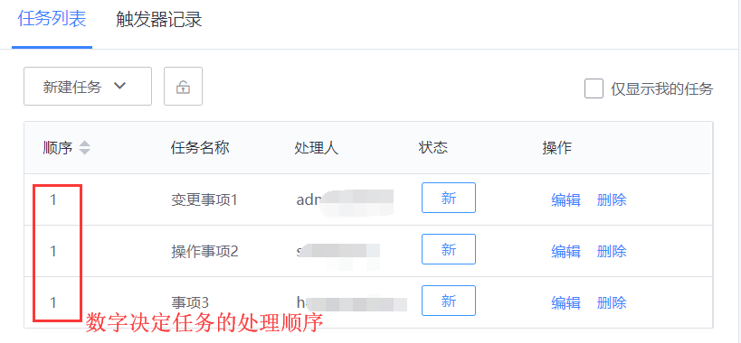

## 任务模板

应用在流程中的任务模块，用来创建及管理在流程处理过程中相关的具体任务事项。

适用场景：流程中的某些节点，已经形成模板的处理规范，但在单据实例发生时才能明确具体的处理内容。

例如：在进行变更管理时，需要确认变更计划。其中涉及具体的变更操作项。而每一次变更的操作执行项可能都不一样，处理人也可能不一样，并且变更事项内容需要待审批通过后才能执行。

### “任务模板”的创建及管理

系统内置普通任务和标准运维任务 2 个模板。管理员可以通过“新增”来创建合适的其他任务模板。

（目前，新增的任务模板只能是普通任务模板）

普通任务模板和标准运维任务模板的区别：标准运维任务模板主要对接标准运维中的流程模板，用以在单据中可以创建具体的标准运维任务。

（说明：由于标准运维流程模板和业务属性强关联，所以如果希望在流程实例中创建不同业务的标准运维任务，在流程设计时，必须将流程和业务强关联。否则，将只能选择标准运维中的公共流程模板。）

任务模板

普通任务模板配置

标准运维任务模板配置

根据需要，将任务的 3 个阶段中的字段属性配置完成，提交即存为任务模板。

### 在流程中应用任务模板

> **配置入口：在流程设计的第三步“流程启用设置”\>高级配置\>任务配置。**

添加任务模板。一个流程中可以添加多个不同的任务模板。添加多个任务模板，表示，在流程单据实例中，可以选择不同的任务模板来进行任务的创建。

任务的应用配置入口

添加任务模板之后，需要进行任务应用的条件配置。

**创建任务的条件**：指任务可以在流程的什么节点被创建。（说明：由于任务需要和单据实例关联，因此任务必须在提单完成之后才能创建。）当流程达到该节点时，当前处理人可以进行任务的创建。

**处理任务的条件**：指任务在流程的什么节点才能被处理。当到达该节点时，任务的处理人将可以处理任务。（说明：任务的创建和处理，不能处于同一节点）

### 单据中的任务创建及处理

任务创建1

新建任务：有 2 种方式来进行任务的创建。

-   直接创建：直接选择任务模板进行创建。

-   从任务库创建：是指从之前的任务库进行选择修改后创建。这里需要用户将之前的任务有存为任务库。（比较适用相对比较固化的任务项）

任务创建2

任务列表

顺序：指任务的执行顺序。任务依照数字从小到大的顺序依次处理。相同的数字表示为并行任务。可以修改任务的顺序数字来改变其执行顺序。

任务只在创建阶段可以进行创建，编辑，和删除。创建阶段完成之后，任务将无法修改。

任务的操作入口

当单据流转到任务处理所处的节点时，任务处理人可以进入到单据详情页面，进行任务的处理，总结。如果任务间是串行，得必须前置任务结束后，下个任务才能开始。
