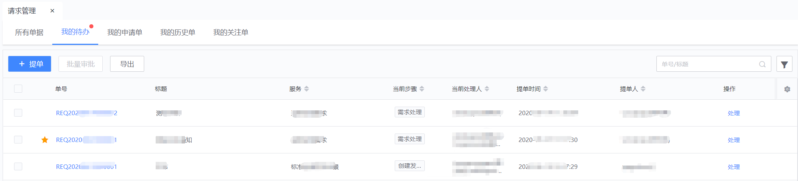

## 请求管理（前台）

### **申请入口**

新增请求入口

### **提交请求**

选择服务

请求申请填单页面

所有单据：暂时对管理员可见。

我的待办：需要登入用户处理的单据列表页。

我的申请单：登入用户提交的变更申请列表页。

我的历史单：我处理过的以及和我相关的单据。

我的关注单：非本人参与或处理，可以通过手动“关注”单据。关注后，单据的进度更新将会通过邮件告知关注人。关注人从“我的关注单”入口也可以查看单据进展。

### **处理请求**

请求待办入口

处理界面

在请求列表页，点击工单号可查看单据详情信息。