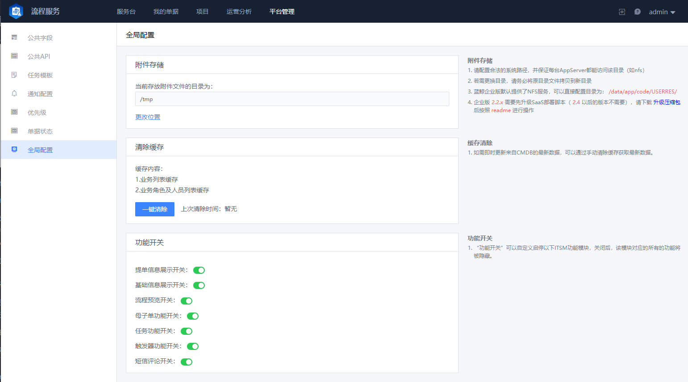

 ## Global Config 

  

 - attachment Storage 

  If you do No Need to use the "Attachment upload" Type Field in the form, you can not setting, otherwise you Must configure the effective path According to required: 

  1. absolute path 

  2. Make sure that The directory is Shared between multiple app service (single one does No Need to be considered) 

  3. Read and write auth for apps user 

     Note the Two point. If user have setting multiple app service for the BlueKing platform, make sure that the directory is Shared accessed under multiple servers: For example, build your own NFS Service or use a Shared network disk to ensure that file can be shared between each Apply instance. 

 - Clear Cache 

  Application Scene: If you need to Update the latest Data from the CMDB immediately, you approve manual Clear the cache to obtain the latest data. 

 - Function switch 

  Start and stop Set for different Apply module.  After close, All functions corresponding to The Module will be Hide. 

  such as that Flow pipelinesPreview switch.  When enable, the Check entry of Flow pipelinesPreview will be Display on the Document details page.  The flow path of the Ticket can be understood approve the Flow chart.  The system enable by default.  If you No Need it, you can select to close. 