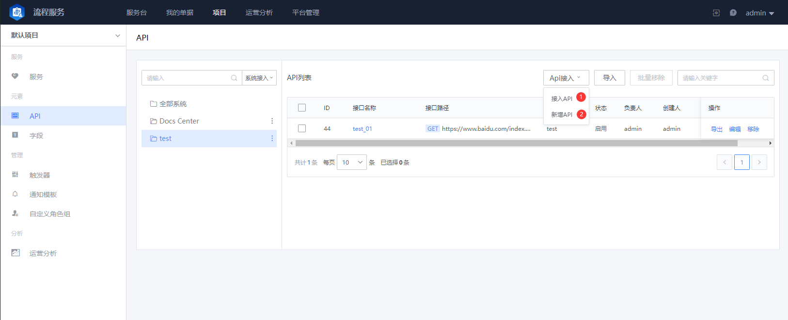
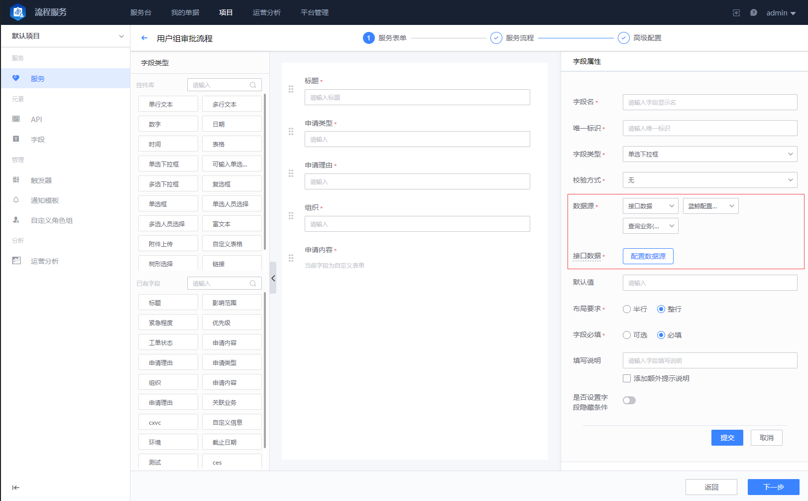

 ## API Manage 

 When you need to reference a third-party system for auto processing in the Flow, or need to reference some Data in the third-party system as necessary information in the process, you can Manage the interface of the third-party system approve the API setting function.  complete Configure, you can directly reference these APIs during Flow Node Set. 

 [ITSM] has built-in system APIs of some BlueKing systems, which can be accessed or maintained as needed. 

 > The API setting Module has a certain threshold, and the Administrator needs to have a full understanding of the call protocol between APIs. 

 1. new API 

   You need to connect to the system before new an API.  After accessing the system, you can append APIs to The system. 
    
    
    
   
API setting
 

 2. API Usage 

 - API Node 

  When designing the Flow, you can directly Choose the appropriate API approve dragging the API Node.  After selected, the corresponding Field Parameter link Set is approve. After the Flow Apply, when the Ticket flows to The Node, the corresponding API is auto called for processing and circulation. 

  

 
append API node
 

  

 
API Node Configuration
 

 - API field 

  When Manage the Flow bill of lading Field, if the field value needs to be called or referenced from a third-party system, the Source can be set to be obtained from API when Set The field value. 

  
  

 
API Field configuration List
 