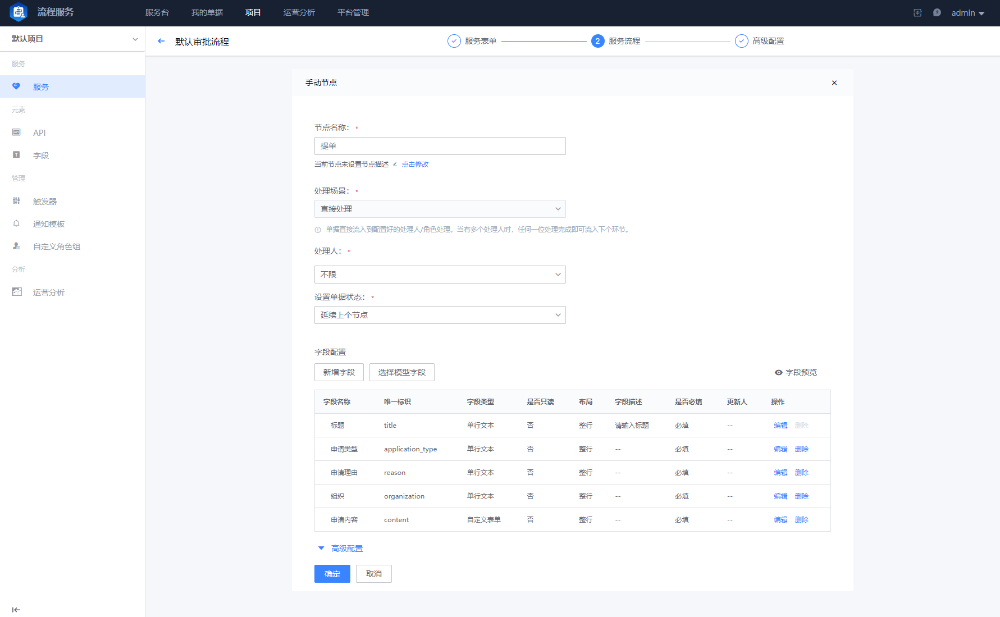

 ## 3. Create service 

 1. Enter the Service page under the Project, and click `new` to enter the service create Flow 
    
    

 - Service name 

  The Name of the Service used to visually represent the target of the service provided, as shown in the figure for the "apply Personal Office Computer" service 

 - Service description 

  More detailed Service complete Description 

 - Directory 

  The directory to which the Service belongs (i.e. the Service Directory planned in prev) 

 - Type of service 

  Service Classification of service, such as `Request Manage` `Change Management` `event Management` `Issue Management`, etc. 

  

 2. After Fill In basicInfo such as the Service Name and Description, you will Enter the `Form Design` phase of the service. This form is similar to the `apply form` that the administrative staff will hand to us according to different service type when we go to the Service window of the local household registration hall; It is mainly used to collect the information needed by the Service provided to meet the target of the demander, such as the urgency of the demander to The demand.  What type of materials are required when apply supplies?  Are there additional requirements?  And so on. 

 Generally, The form also expresses the scope of service capabilities that the Service provided can provide, within which the demander can Fill In and Submit as needed. 

 - Control library 

  provided various type of Field controls, which can be select by the user according to the needs of the Scene 

 - Bill of lading Field 

  Display the full content gateway of the bill of lading Field 

 - Field attribute 

  Set the properties of a form Field 

 3. After setting the Service Form, click next Enter the "Flow Configuration" Step of the service, and the user designs the process Node according to the service processing steps; 
    

 - Flow nodeType 

  Available Flow nodeType 

  - Manual Node 

    The Type provided the Feedback Scene of manual processing. user can Custom Set feedback information Field in the Node. When the Flow runs to this node, the processor needs to manually confirm the Run Confirm Continue. 

  - API Node 

    The Type provided the ability for the Flow to call Other third-party system APIs, and is often used in some auto processing Scene, such as Set the properties of resources, opening the Function switch of a system, and so on 

  - Standard OPS 

    Connect with BlueKing Standard OPS Flow, and setting the processes create in standard OPS execute specific Task 

  - BlueKing CI (Not yet open) 

    The Pipeline for docking BlueKing CI (BlueKing CI) has Not yet open yet 

  - Approval node 

    For specific type of node in approval Scene,`Or-Sign` and `countersign` are provided 

  - Parallel Gateway 

    It is used to Set multiple node that need to be processed simultaneously and in parallel. It is often used in Scene where multiple teams need to process at the same time in a specific Flow link 

  - Converge Gateway 

    Node used to aggregate multiple parallel processing step. The processing result of each node can be aggregated and processed Scene 

 - Flow Logic Canvas 

  Chain the Flow step together into One complete process 

 _Bill of Lading node example_ 
  

 _Approval node example_ 

  

 4. After designing the Service Flow step, click next Enter the final general service setting phase 

  

 - visibleRange 

  Set the scope of user who can see the bill of lading entry for The Service 

 - Withdraw mode 

  Set whether the user bill of lading can be Withdraw, and how to Revoke 

 - auto processing 

  When a Consignor appears in the approval Node Processing Flow, it can be auto marked as `approve`. 

 - noticeType 

  Set up Status and progress notification channels after bill of lading 

 At this point, One complete Service is create. 