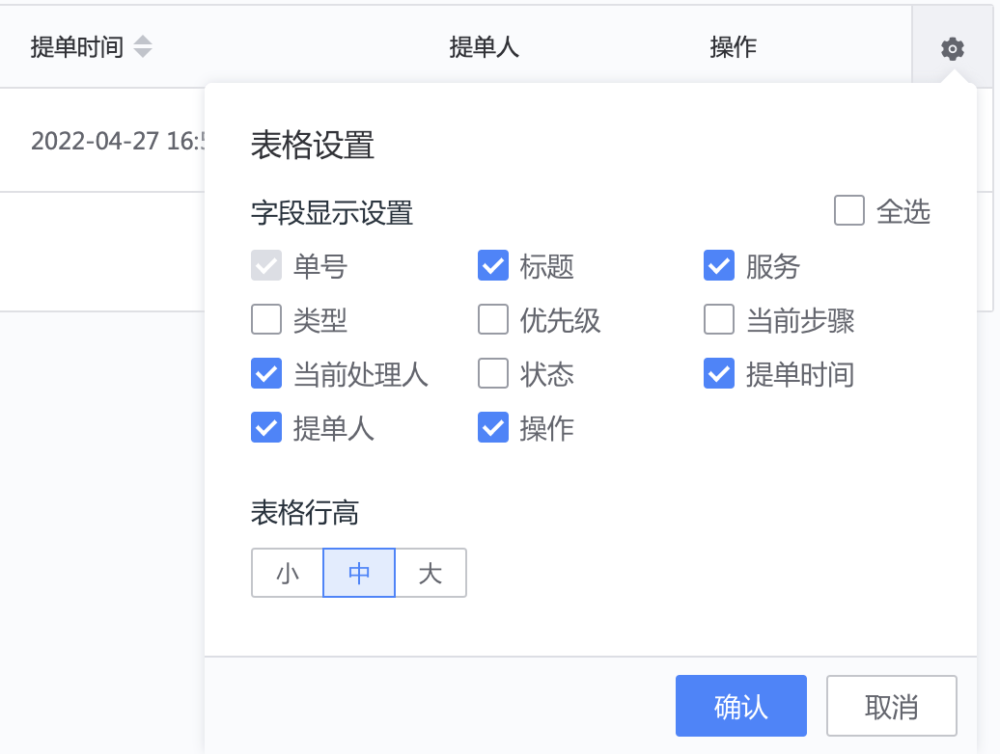

## 项目单据管理
展示项目空间下的服务单据数据，以服务团队的维度查看管理关联的用户单据

1. 单据分类 TAB

   根据不同的服务类型分类以 TAB 分隔显示，同时支持用户自定义条件组合新的 TAB

   

2. 单据列表

   根据所选标签 TAB 的条件过滤展示所有符合条件的单据，列表显示的字段可以自行配置，同时支持“导出”

   

   _列表字段设置_

   

   _列表导出设置_

   
