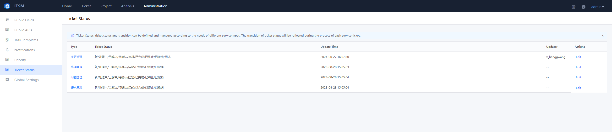
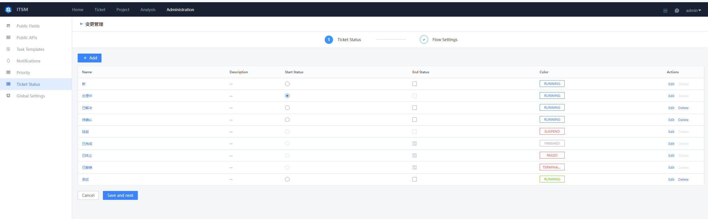
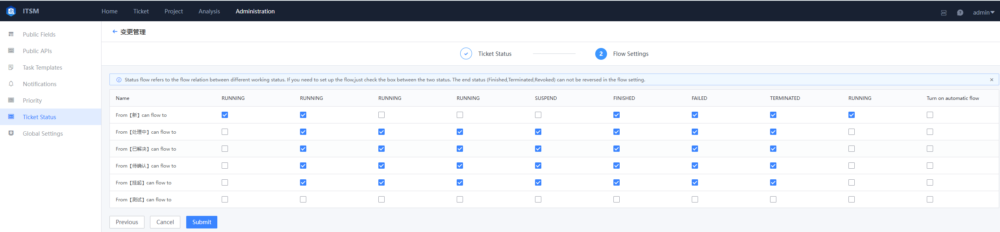

 ## Ticket status 

 You can Custom Manage the corresponding Ticket Status and the flow rules between statuses for different Service type as required.  The Update and changed of Ticket Status will be reflected in each specific Service document circulation process. 

  

 
Ticket status List
 

  

 
Ticket status List
 

 Apply Scene of work order Status: 

 1.  This setting can be approve to satisfy the great difference in ticket Status of Service type. 

 2.  The work order Status is related to the timing standard of the Service agreement.  You can set the service timing rules for different Service type, including the status of starting timing, the state of ending timing, and some intermediate states in the process that do not count the totalTime.  The Service timing requirements in different Scene can be more flexibly supported. 

 -   Ticket status Settings 

    Set the appropriate work order Status according to the actual demand, and set the start status and end status. **  You can Choose only one start status, and multiple end statuses are supported. **  After the Start State is set, that is, once each Ticket is successfullySubmited, its initial status is the set Start Status.  After the End status is set, the Ticket cannot be Operation again. 

 -   flow setting 

    Flow setting is used to Set the priority flow relationship between work status.  If you need to Set The flow, check the multiple between the two status.  The end Status (e.g. succeed, terminate, Undo) cannot be reversed. 

  

 
flow setting
 

 -   service Duration Processing Rules 

    When a Service needs to Enable an SLA, the statistical rules for the service duration need to be set in advance.  Set the start/end Status of timing in the Ticket flow process, and the special status of not counting timing in the process. 

    After the Set are complete, the Ticket instances under the Service will Start Up the service duration statistics under the corresponding Priority according to the rules set in the agreement. 

 &gt; Note: 
 &gt; 
 &gt;   1.  The Revise of statistical rules for Service duration will be directly Take Effect in the existing Ticket instances. Please Operation with caution. 
 &gt; 
 &gt;   2.  The SLA timing rule will be triggered only when the Priority of the Ticket is not blank. 

  

 
service Duration Processing Rule Settings
 