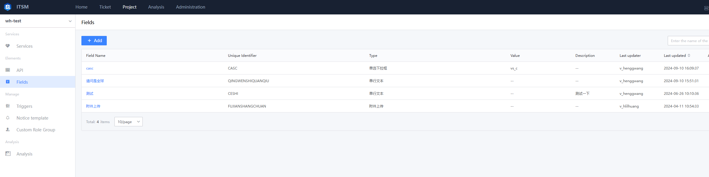
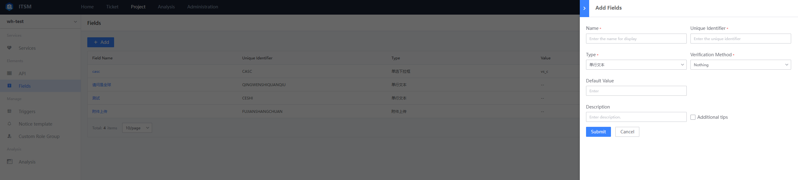

 ## Field Manage 

 If the definition of One form Field is the same under the Project team, it can be precipitated approve the field Manage function, and can be Apply by reference in Other Service Form to achieve the effect of unified application and management! 

 click `new` or `edit` an existing Field: 
  
  

 - Name 

  The Name of the Field Display in the Service Form 

 - Unique identification 

  Globally unique identity for the Field 

 - Type 

  There are many types of Input interaction space for Field in the form, and user can select to setting as needed 

  - Single line Text 
  - Multiline Text 
  - Numeric 
  - Date 
  - Time 
  - Table 
  - Single selection drop-down box 
  - Single drop-down box can be Input 
  - Multi-choice drop-down box 
  - Multiple 
  - Enum 
  - Personnel select (single choice) 
  - Personnel select (Multiple Select) 
  - Rich Text 
  - Attachment upload 
  - Customize Table 
  - Tree select 
  - Link 
  - Customize Form 

 - Check mode 

  Used to Check user values 

 - RawData 

  To setting the Source of user selectable Data, such as single selection drop-down box, you need to configure the options Source in the drop-down box 

 - defaultValue 

  Default populated Field value 

 - Description for Fill In 

  Description copy when Field is blank 