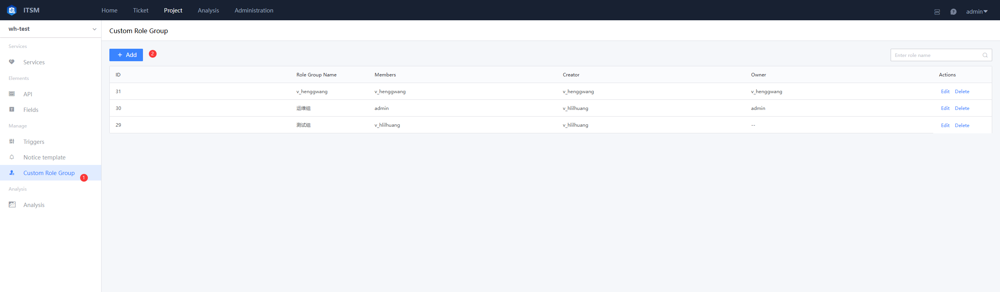
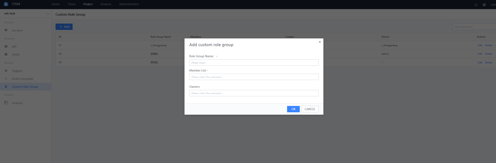

 ## Customize Role Group 

 It mainly refers to the full-time Role that undertake different service, for example the Base implementation personnel of Safety network, the principal of toCheck Account opening, and the implementation personnel of opening account remote allowEnter, etc., which perform daily Manage of adding, deleting and modifying roles and personnel according to actual Scene; The Project team can Manage the general "userGroup" according to the Service Scene requirements, so that it can be Apply and managed uniformly in different services. 

 click `New` to Created a new userGroup: 

  
  

 - Role groupName 

  The Name of the Role group, such as R & D personnel, front-line customer service personnel, logistics personnel, etc., which represents the name of the specific function 

 - List of personnel 

  List of people for The userGroup 

 - Principal 

  The user responsible for Manage this userGroup 