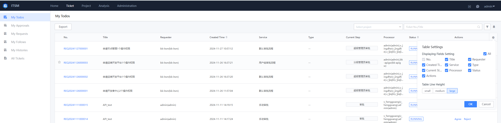
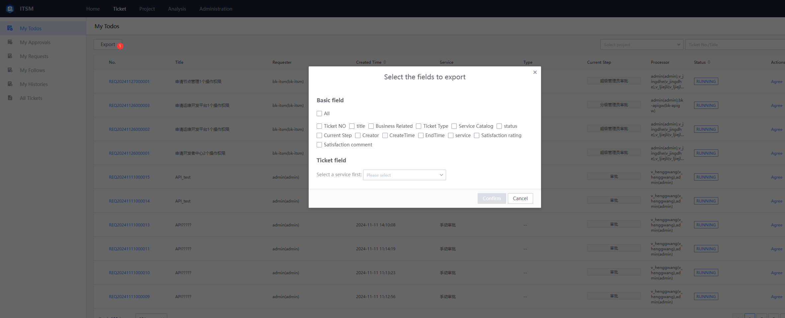

 ## Project Ticket Manage 
 Display Service Ticket Data in the Project space, and Check manage link user documents in the service team Dimension 

  

 1. Ticket Service Classification TAB 

   It is Display by TAB separation according to different Service type, and supports user conditions to combine new TAB 

    

 2. Ticket List 

   filter display All Meets The Ticket according to the conditions of the selected label TAB. The Field Display the list can be setting by yourself. Export is also supported. 

    

   _List Field Settings_ 

    

   _List exportPipelineJson Set_ 