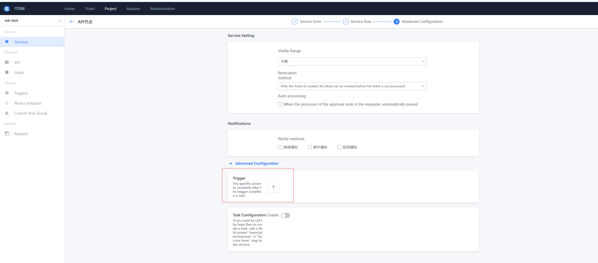
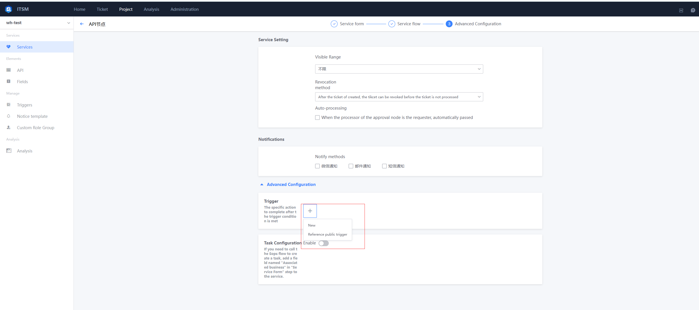
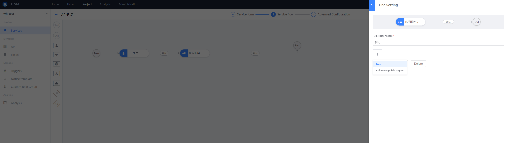
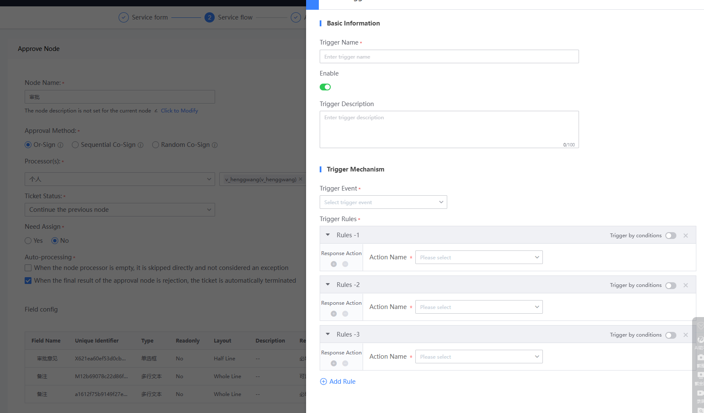
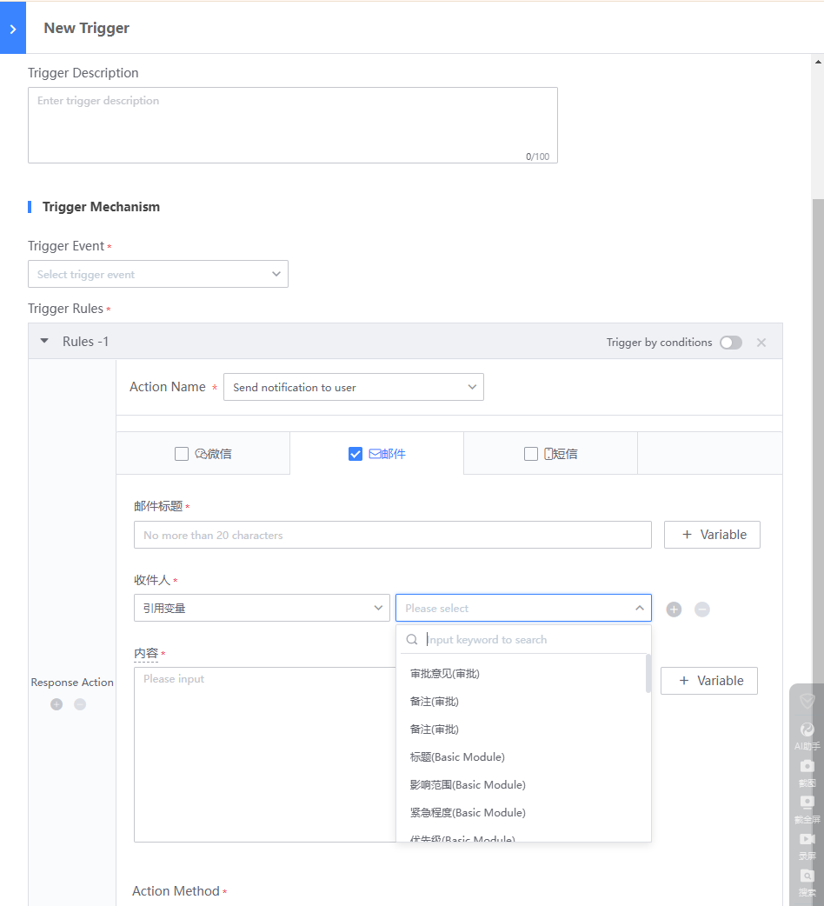
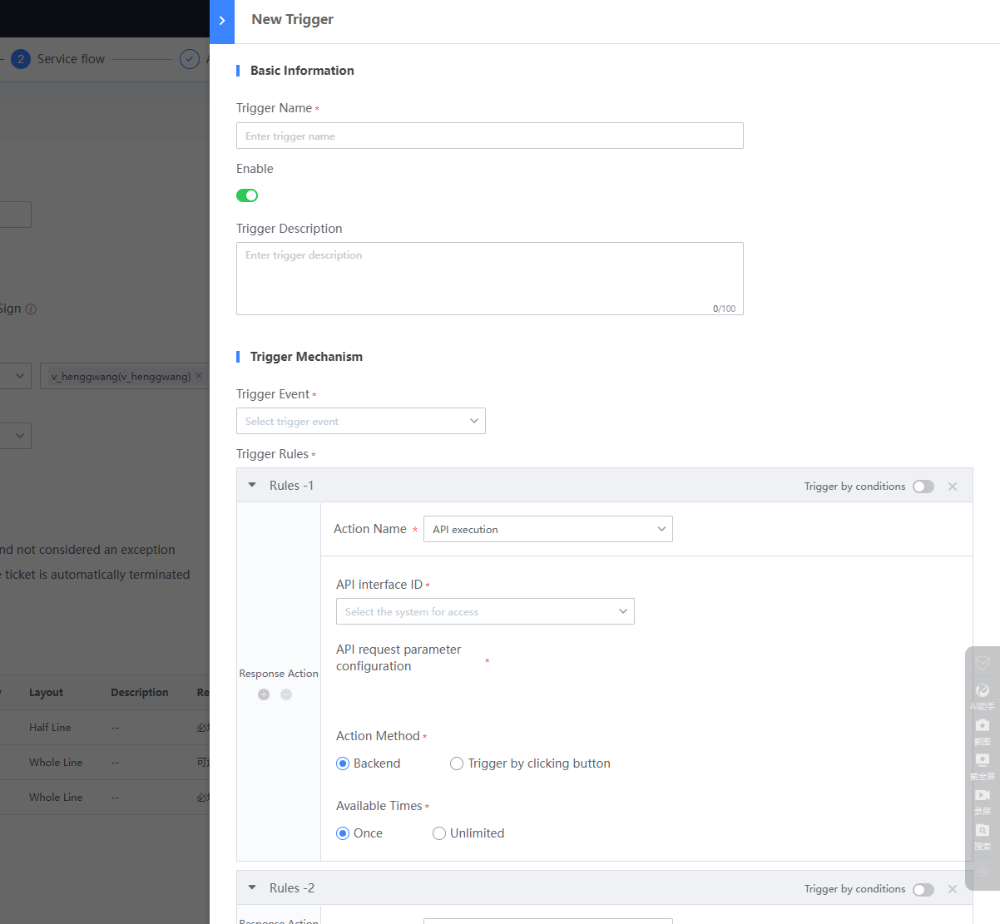

 ## Triggers Manage 

 One set of mechanisms consisting of trigger event, trigger rules, and Response actions to satisfy the personalized Business Name logic in the Flow Scene. 

 for example: 

 1. When nodes is complete, you want to call the specified API to notify the third-party system. 

 2. When you Enter nodes, you can modify the handler of the current node according to the different values of the specific Field in the previous node. 

 3. After a key Node is complete, it is desirable to auto trigger additional notifications to specific people. 

<table>
     <tr>
         <th rowspan="1">Categories of triggering events</th>
         <th rowspan="1">Trigger event subclass</th>
         <th rowspan="1">How to trigger the rule</th>
         <th rowspan="1">Response action</th>
         <th rowspan="1">Configuration entry</th>
     </tr>
     <tr>
         <td>Document class</td>
         <td>Create Document Close Document End Document Suspend Document Resume Document Revoke Document</td>
         <td rowspan="4">Method 1: Default trigger Method 2: Conditional trigger</td>
         <td rowspan="4">API Execution Modify Processor Modify Work Order Status Send Notification to User Unbind Mother-Child Order</td>
         <td>Process Design>Process Enablement Settings</td>
     </tr>
     <tr>
         <td>Node class</td>
         <td>Enter node Leave node Distribute document in node Receive document in node Transfer document in node</td>
         <td>Process Design>Definition and Configuration Process>Node Configuration>Advanced Configuration</td>
     </tr>
     <tr>
         <td>Line class</td>
         <td>Enter branch</td>
         <td>Process Design>Definition and Configuration Process>Flow Condition Configuration</td>
     </tr>
      <tr>
         <td>Task class (applicable only when the task module function is enabled)</td>
         <td>After creating a task Deleting a task Before executing a task After executing a task After completing a task</td>
         <td>Task Templates>Advanced Configuration</td>
     </tr>
</table>

 Trigger can be divided into the following types according to the specific location of their Apply: 

 - Common Triggers: 
  general Parameter can be called to implement the Basic Config in One Shared Base model, which can be referenced in Flow instances under the same model.  The reference here refers to Copy One copy of the setting in the public Trigger to the reference location, which can be Revise according to specific needs.  The Revise content is not Update to the referenced public Trigger.  The Manage and maintenance of public Trigger is generally the responsibility of the super Administrator. 

  Reference policy: Trigger that match the reference location.  For example, if a Trigger is referenced in a Node, only the public trigger of "trigger Event type = node signal" can be referenced.  When referring to Trigger during flow condition setting, only public triggers with "trigger Event type = line signal" can be referenced.  The system auto filter the common Trigger that are not applicable based on where they are referenced.\*   

 - Flow Triggers: a trigger setting under the global event of a process Ticket. When a trigger in a process references a common trigger, the Base model Must be consistent or blank. 

   

 
Flow Triggers Entry
 

 - Node Trigger: triggers that occur in the node instance 

  

 
Node Trigger entry
 

 - Line Triggers: A trigger that Enter into a line instance 

  

 
line Trigger entry
 

 ### Create a Triggers 

  

 Apply mechanism of Trigger: when a trigger event occurs in a Ticket, a Response action is execute According to the trigger rule. 

 - A single Trigger can match only One triggering event. 

 - Multiple trigger rules can be Set. As long as the rules are satisfied, the actions under the corresponding rules will be Response. 

 - By default, the rule is triggered without condition: it means that the Response action can be directly execute when the event is reached.  The condition trigger setting supports two levels of condition group configuration, and the corresponding relationship Expression can be select according to the user's needs. 

 - The type of Response actions are currently built into the system.  There are two ways to execute Response actions: 

  1. Background auto execute: indicates that the Trigger is activated and executed directly without intervention by the foreground user. 

  2. Foreground Button Trigger: After Triggers is activated, One button record will be Generate and displayed on the Ticket page, which is Manual triggers by the user.  The trigger count is One, which means it can only be execute once.  Multiple times, indicating that the button is always present and can be clicked multiple times to execute. 

 
node Triggers setting 4
 

 Send notifications: You can setting the noticeType and content, and it is One combined Response Plugin. 

  

 
Response action
 

  

 
Response Action-Send Notification
 

 API execute: Fill In the Request Parameter of the API according to the system API setting. 

  

 
Response Action-API execute
 
