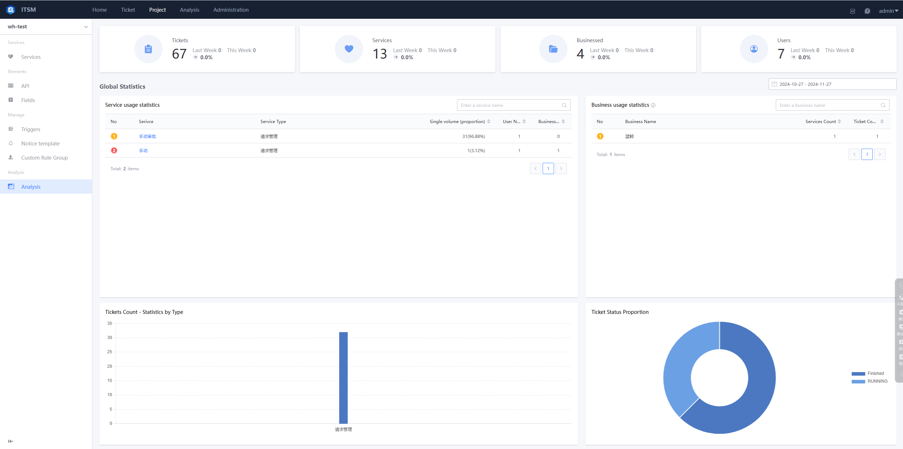

 ## Operation Analysis 

 The Analysis is mainly displayed approve chart statistics, so that Manage can better understand the current overall ITSM situation.  Such as Ticket quantity, Status Distribution, totalTime, etc.  provided corresponding Data reference for Service Efficiency and Quality improvement. 

  

 
Analysis
 