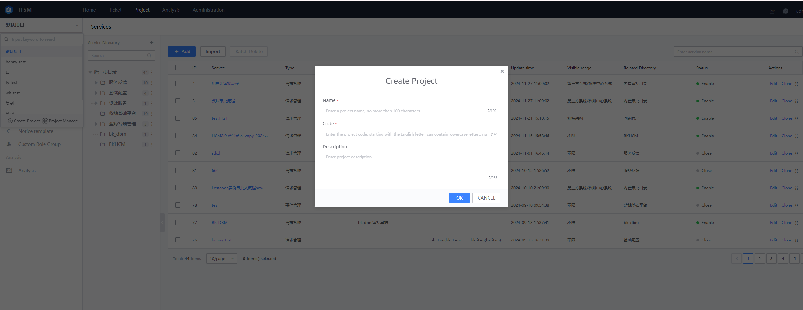

 ## 1. NewProject 

 After Enter the ITSM, click "Project" in the top Navigation, and enter the project create page approve "newProject" in the project select list window. 
  
  

 - projectName 

  Create One projectName based on your team's Service Type and Scene 

 - project code 

  The Field is a unique identifier, which is mainly used when the peripheral system calls the specified project approve the interface. 

 - projectDesc 

  summary Description of Project Service Scene 