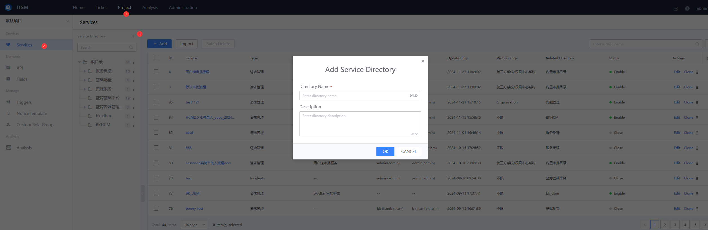

 ## 2. Planning Service Directory 

 Enter the Service page under the Project, and click `add` on the Right side of BRoot Directory/B in the Service Directory on the left 

  

 - Parent Directory 

  auto Choose the parent directory to which the current add directory belongs 

 - Directory name 

  Fill In the Name of the directory, generally used to represent the name of a class of service 

 - Catalog description 

  description of The Service Directory 