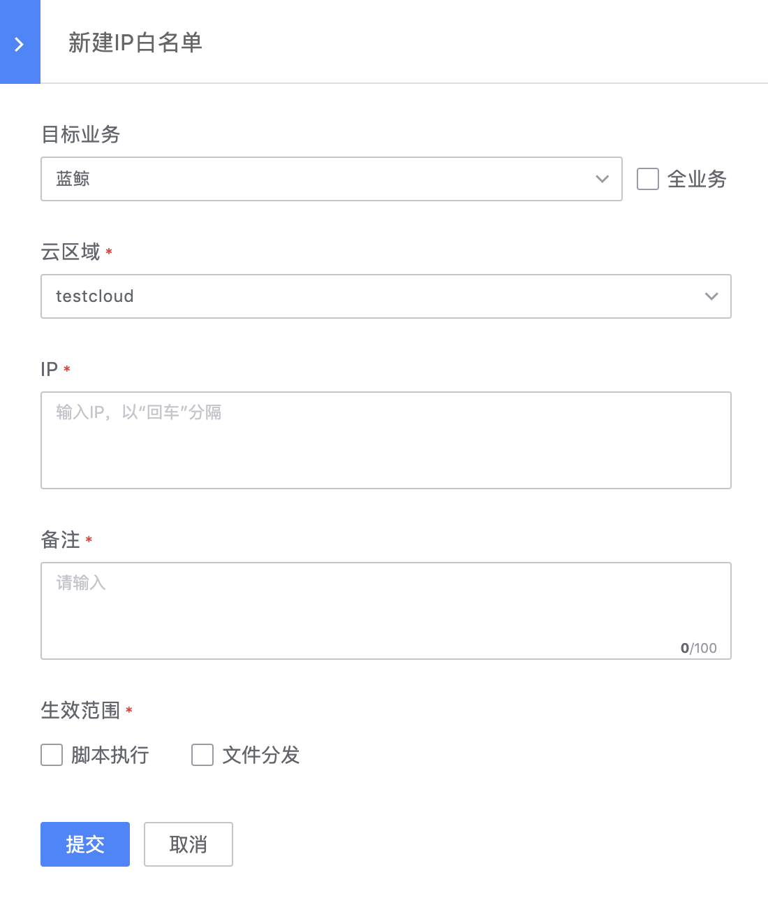

# IP 白名单

由于作业平台中业务之间是逻辑隔离的，即用户只能执行指定业务下关联的脚本/作业或主机，不允许资源或目标是跨业务的；但当用户是平台业务维护场景时，就需要跨业务传文件/执行任务，这是就需要将业务外的主机加入 IP 白名单来实现。（该功能未来会通过配置平台的「业务集」来提供，届时 IP 白名单功能会在迁移后下架）

## 新建 IP 白名单

- 目标业务

  该白名单生效的业务范围（多选）

- 云区域

  选择对应的云区域

- IP

  输入白名单的 IP 列表

- 备注

  提供注明该条记录的用途说明

- 生效范围

  选择该条记录的操作生效范围，即作业平台的原子能力：`脚本执行` 和 `文件分发`

