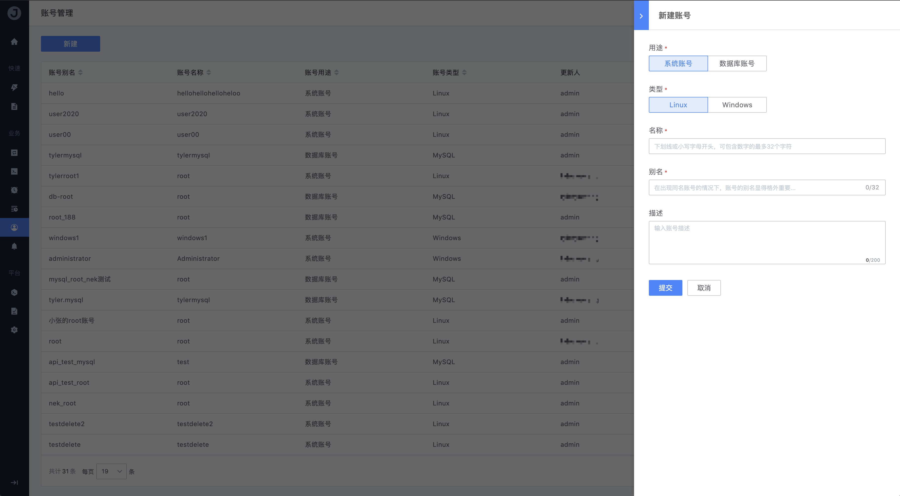

# 账号管理

账号管理功能提供用户按不同业务来存储管理不同类型的 OS 执行账号；当然，如果企业内部已有相应的“账号管理系统”（如铁将军系统），那么这里的账号就需要用户根据实际情况进行配置使用；因为作业平台自身并不会直接关联服务器操作系统上的账号鉴权模块，这里仅提供账号的配置维护管理。

## 创建账号

点击表格上方的「**新建**」按钮创建一个新的服务器账号：

- 用途

  选择对应的账号使用对象，如 `系统账号` `数据库账号`

- 类型

  根据不同的对象，选择相应的账号类型

  - 系统账号支持的类型：`Linux` `Windows`
  - 数据库账号支持的类型：`MySQL` `Oracle` `DB2`

- 名称

  账号的实际名称，即在服务器操作系统上的真实名称，如 `root` `user00`

- 别名

  账号的别名，在出现同名账号的情况下更需要

- 密码

  服务器账号的密码，如 Windows 操作系统的 Administrator 密码

- 确认密码

  对密码做二次确认

- 描述

  填写该账号的适用场景或应用对象的备注描述