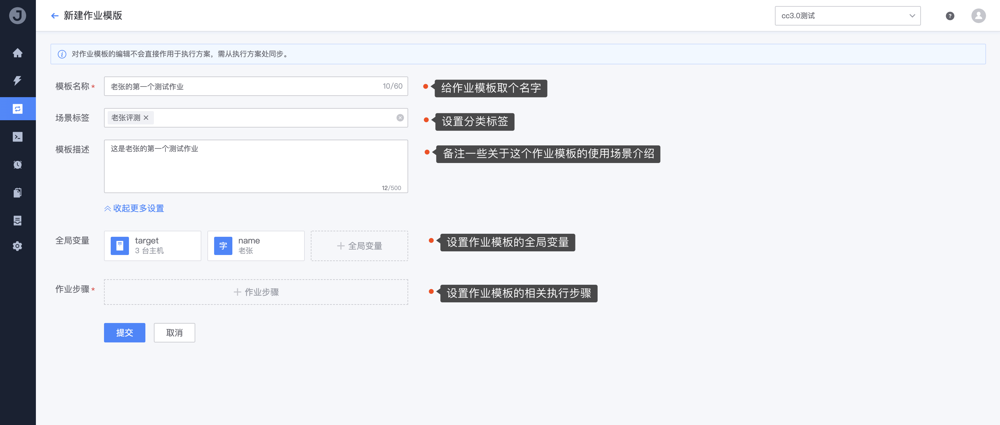
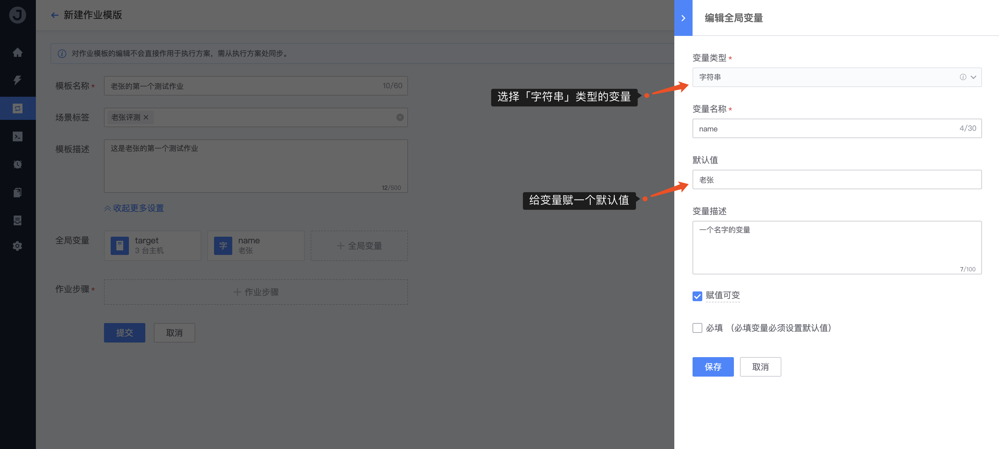

# 4. 创建作业模板

「作业」是用于组装一个或多个操作节点的流程统称，就像工厂的流水线作业一样，将几个需要的操作拼装到一个流程中，使其能够串联起来实现一键自动化执行。

在作业平台中，一个可执行的完整「作业」是由 `模板 + 执行方案` 组成的；模板提供的是通用、标准且统一模式化的完整样板，而执行方案则是从模板中根据场景需求而衍生出来的相应实体。

## 前置条件

```bash
1. 业务下有可执行的服务器（Agent 状态正常）
2. 准备好系统执行账号（必备）
3. 准备好一个「已上线」的脚本（可选）
```

## 操作步骤

1. 在 `作业` 页面中，点击 **新建** 进入

   

2. 按照表单中的要求输入作业的基础信息，和步骤内容

   

3. 设置 `name` 字符串，和 `target` 的主机列表变量，提供作业步骤中使用

   创建 `主机列表` 变量：

   

   创建 `字符串` 变量：

   

4. 添加执行步骤，引用我们刚才建的脚本和变量做示例

   步骤一、引用刚才创建的脚本

   

   步骤二、直接写临时脚本，用上全局变量 `name`

   

   步骤三、加个人工确认步骤，演示一下

   

5. 最后点击 `提交` 按钮，保存作业模板；至此，作业模板就创建完毕

   

更多详尽的作业相关功能介绍，请前往 [作业管理功能说明](../Features/Jobs.md) 。