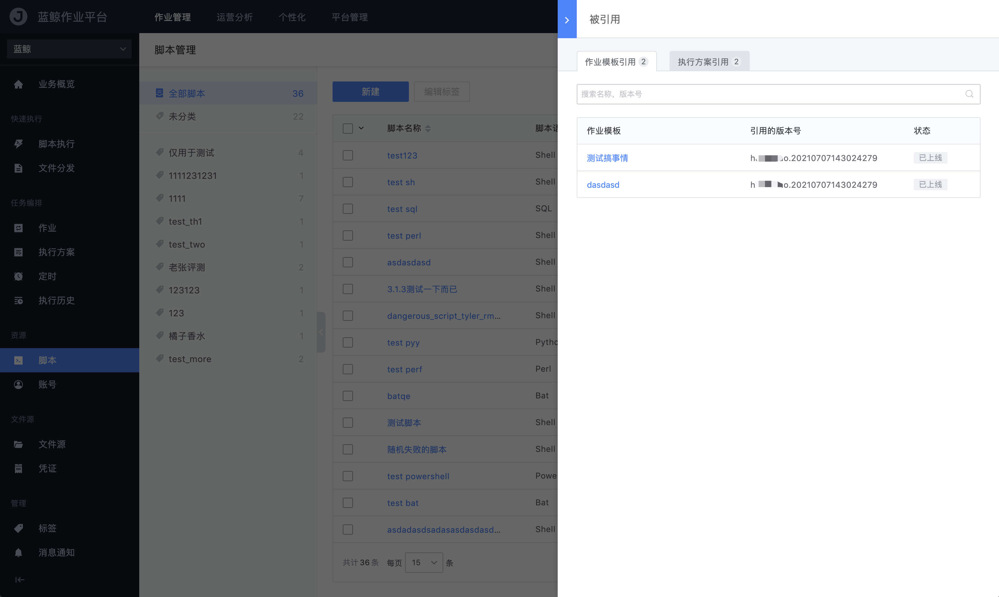
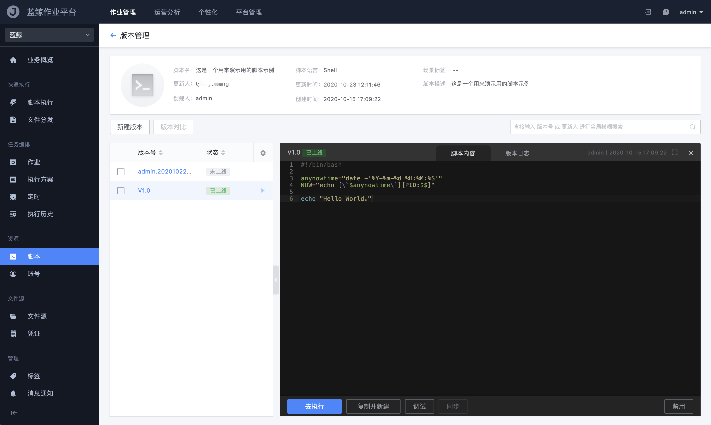
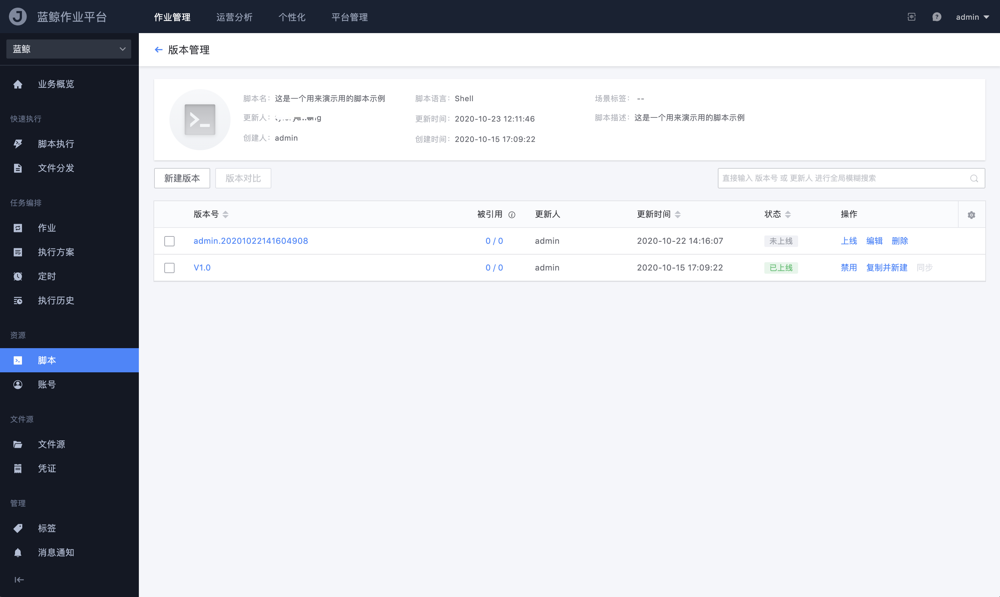

# 脚本管理

「脚本管理」提供业务管理维护脚本的功能，包括脚本的引用关系、版本日志、版本上下线/对比等等；本章节为大家介绍脚本管理的相关功能和逻辑关系。

## 引用关系维护

作业模板的步骤中可以选择引用业务脚本，所以在脚本列表中的「被引用」一列可以显示出各脚本的被引用关系。

## 新建脚本

从列表页的「新建」按钮进入脚本新建页面：

- 脚本名称

  为这个脚本起一个能直观表达它的用途的名字

- 场景标签

  脚本使用场景的标签分类（同作业标签）

- 描述

  脚本的使用指引或功能说明的明细备注

- 版本号

  用于区分脚本的不同版本的标识（类似 Github 的 version）

- 脚本内容

  当前版本的脚本内容

按照要求填写必要的参数内容后，点击提交即可完成新脚本的创建：

## 脚本的版本管理

版本管理提供了版本的新建/编辑、上/下线、禁用、代码对比等功能，帮助用户有序维护脚本的诸多版本。

- 版本的状态

  - 未上线

    新建的版本默认处于该状态，可以反复编辑修改，相当于草稿状态

  - 已上线

    上线后脚本才可以去执行或者被作业引用，而一旦版本上线后，只能通过复制并新建来克隆出新的版本号

  - 已下线

    在已有 `已上线` 版本的前提下，点击其他版本上线后会将原线上版本置为 `已下线`，但不影响已引用的使用

  - 禁用

    置为 `已禁用` 后，该版本将不可用！线上已引用了该版本的都将「不可执行」！（安全功能）

- 版本对比

  勾选任意两个版本后，可以通过该功能比对代码的差异

  