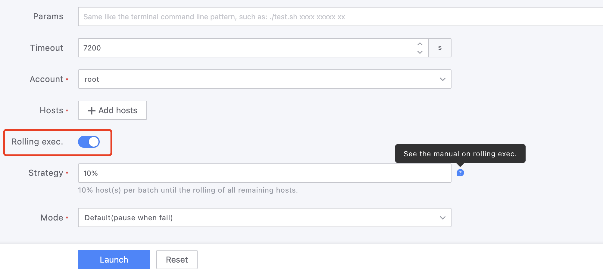
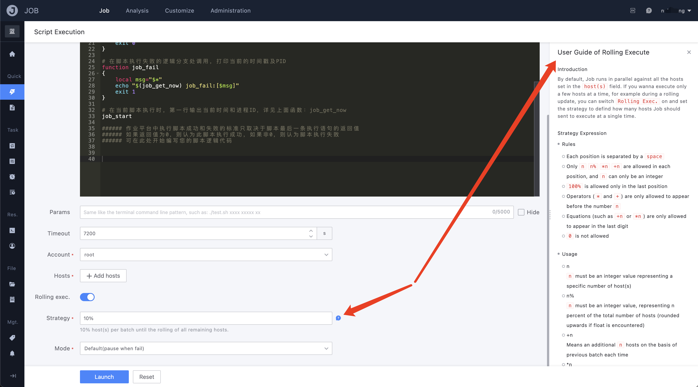
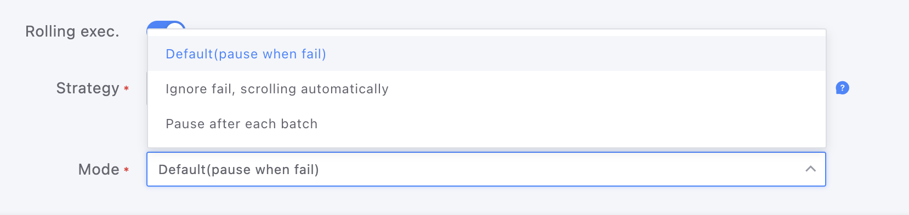
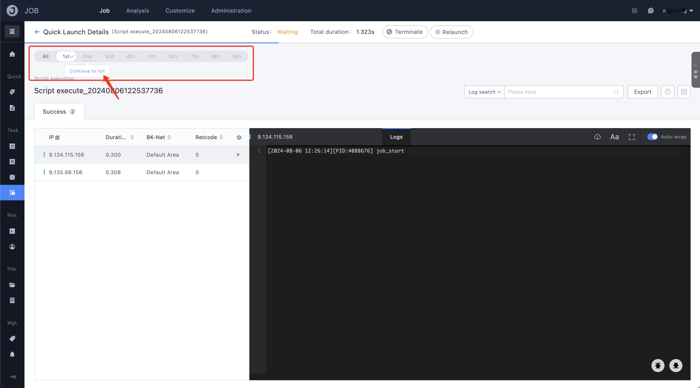

# How to use rolling execution to achieve gray update?

The "Rolling execution" feature of the Job platform supports executing a specified batch of machines in batches according to agreed-upon rules, and can set the interaction mode between batches. Therefore, users can use this feature to achieve scenarios similar to "gray release".

## Operation example

1. Turn on "Rolling Execution"
    

2. Develop an expression that meets your needs according to the rules of the expression
    The 10% in the figure means that every batch takes 10% of the total number of execution targets to execute
    

3. Set the "Rolling Mode"
  - Default (pause when fail)
    If there is an execution failure in the batch, the task will automatically pause, and can only continue after the user confirms
  - Ignore fail, scrolling automatically
    Regardless of success or failure, the task will automatically move on to the next batch after completion
  - Pause after each batch
    Regardless of success or failure, after each batch is executed, it will enter the "manual confirmation" step, and can only continue after the user confirms
    

4. Start rolling execution
The rolling task details page displays all batches of the task, and provides an "All Batches" entry to help users view the overall execution situation from a global perspective.

