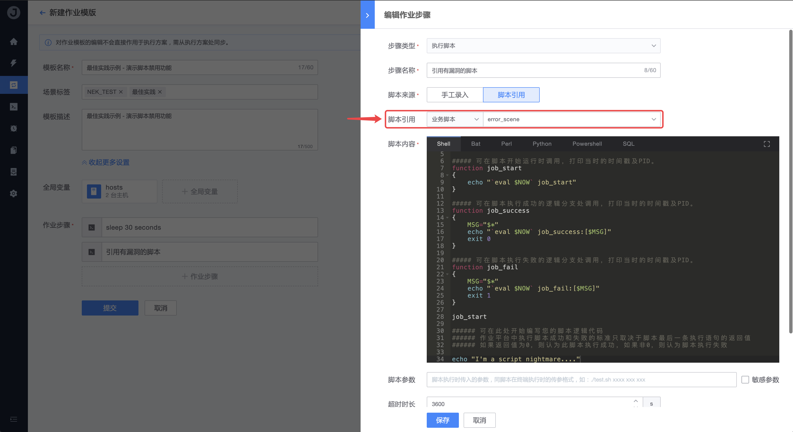

# How to deal with high-risk scripts in time to avoid the expansion of influence

When using open source software, we often encounter security issues such as a vulnerability discovered and exploited by hackers, which may cause business information leakage; usually when encountering a high-risk vulnerability, we will immediately stop online services and upgrade urgently After fixing the vulnerability, it will resume external service. Similarly, when a public script is found to have logic errors/vulnerabilities, we do not allow business operations to cause unpredictable failures/losses due to the script being referenced, and hope to stop it as soon as possible!

In the script management of the operating platform, the `disable` function can help you stop the loss in time and stop the problem before it breaks out in a large area! An example will be used below to demonstrate how the script `disable` function of the job platform works.

## Steps

1. Create a business script `error_scene`

    

2. Reference the script in the steps of the assignment `Best practice example - Demonstrating script disabling functionality`

    ```text
    Because we need to switch to disable scripts during the process, we sleep 30 seconds to wait for the first step to meet the needs of the demonstration
    ```

    

3. Set the referenced script version to `disabled` state

    

4. Observe the execution of the job

    

    When the job is executed, it prompts "The referenced script version has been disabled and cannot be executed."

## In conclusion

As in the above demonstration case, as long as the version of the script is set to `disabled`, the job execution plan that references it will report an error and terminate the execution at runtime, so as to prevent the vulnerable script from being used online in time and cause serious damage. Fault.