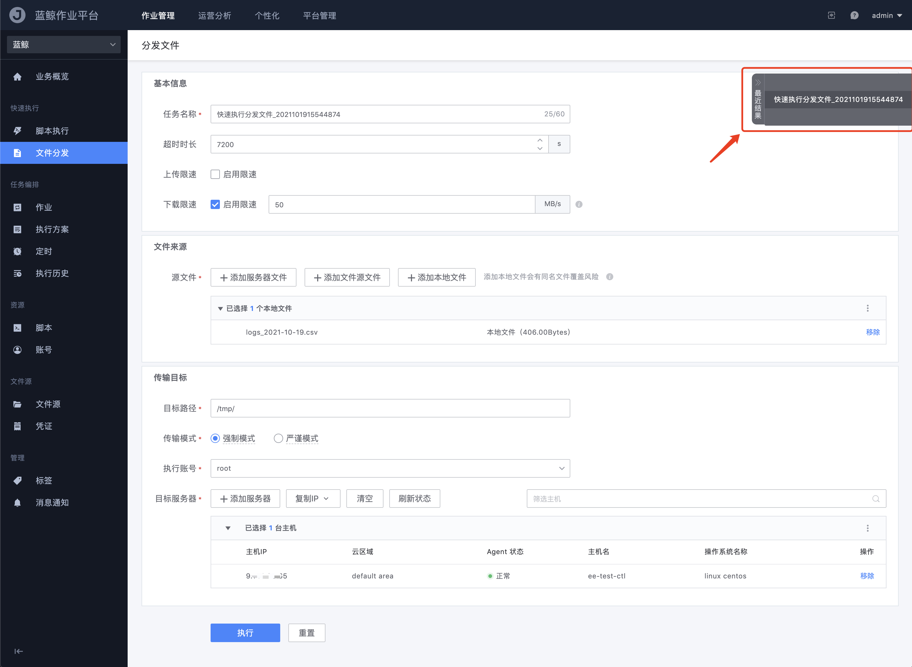

# Quickly distribute files

Same as the usage scenario provided by the "Quickly Execute Script" function, the purpose of quickly distributing files is also to allow users who need to transfer files at one time to quickly execute and get results here.

- mission name

   The task name of the distribution file, which is convenient for follow-up in the execution history

- timeout duration

   The timeout setting for the distribution file, when the file transfer time exceeds, it will be automatically closed, and the result is considered as "execution timeout"

- Upload/download speed limit

   Since the default configuration of the BlueKing management and control platform Agent will be limited according to the server bandwidth and resource usage, to prevent the occurrence of machines that cause business down due to the tasks performed; so when the user himself confirms that the machine allows maximum transmission, by The speed limit setting can increase the transmission rate

- Source File

   Source file selection for distribution, support to select `local file` or `server file/directory` *(file source file is not open yet)*

- Target path

   The absolute path address of the file distribution to the target server, providing 2 built-in variables available:

   

- transfer mode

   > `Force mode`: No matter whether the target path exists or not, it will be forced to transfer according to the target path specified by the user (if it does not exist, it will be created automatically)
   >
   > `Strict Mode`: Strictly judge whether the target path exists, if not, the task will be terminated directly
  
- Execution account

   The account related to the target server for file distribution, such as `root` in Linux system or `Administrator` in Windows system

- target server

   Obtain the target server for execution from the BlueKing configuration platform, and support selection through `static-IP selection` `dynamic-topology selection` `dynamic-group selection` and `manual input`

Similarly, in order to meet the usage scenarios where files need to be transferred repeatedly, the page provides the function of quickly viewing the last 5 file distribution records:

