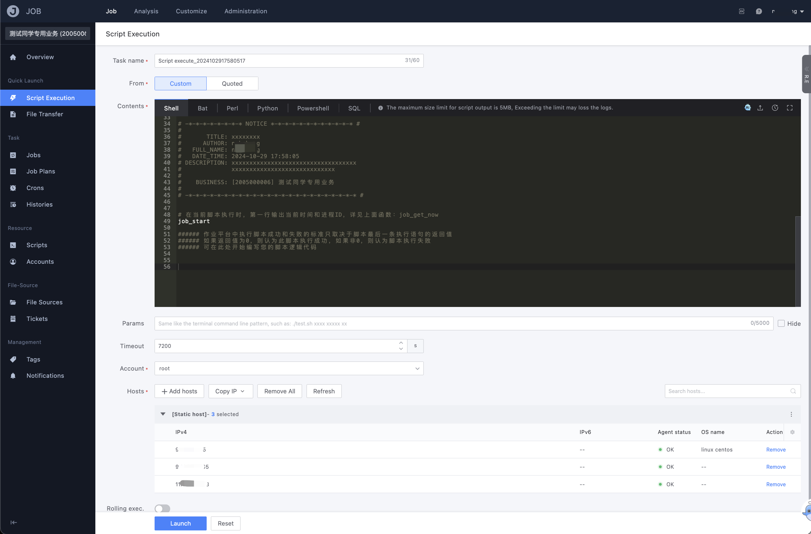
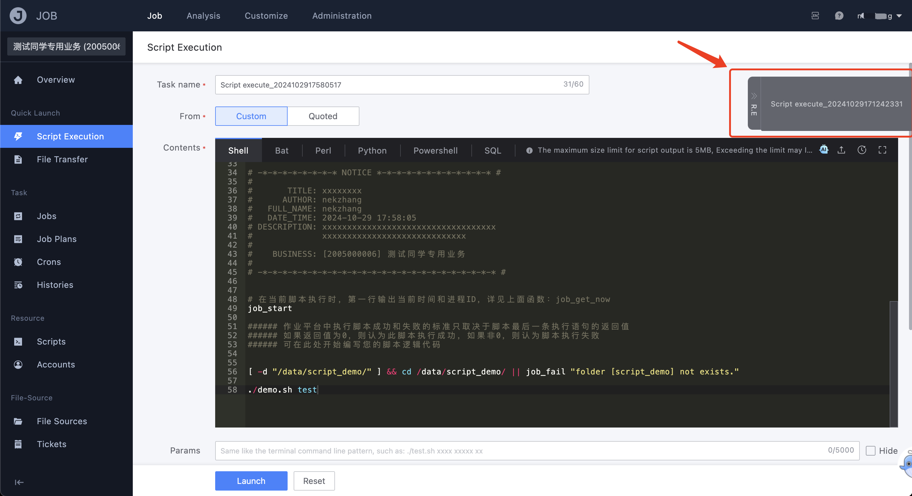

# Execute the script quickly

The usage scenario provided by the quick execution script is for one-time tasks that need to be executed quickly, and the script logic may be repeatedly adjusted to execute to obtain the results that the user wants to know, similar to the effect of executing on the console of the terminal springboard.

- mission name

   The name of the task executed by the script this time, so that it can be traced in the execution history later

- Script source

   There are two ways to provide the script content of this execution: `Custom` and `Quoted`

   - "Custom" means that the user directly writes the script content in the script editor of the current page
     - In the upper right corner of the script editing box, the functions of `Upload`, `Drafts` and `Full-screen` are provided
   - "Quoted" is to support the execution of existing scripts from the script management or public script library
     - Quoted script content cannot be edited

- script content

   Displays the current manually entered or quoted script content area. The supported script languages are: `Shell` `Bat` `Perl` `Python` `Powershell` `SQL`

- Script parameters

   The parameter passed in when the script is executed is the same as the parameter passed format when the script is executed on the terminal, such as: `./test.sh xxxx xxx xxx`

   The `Sensitive Parameters` feature supports masking of script parameters, which is useful when the parameter information is sensitive.

- timeout duration

   The timeout setting for this script execution, when the script execution exceeds this time, it will be automatically closed, and the result is regarded as "execution timeout"

- Execution account

   Select the account related to the target server for script execution, such as `root` in Linux system or `Administrator` in Windows system

- target server

   Obtain the target server for execution from the BlueKing configuration platform, and support selection through `topology selection IP` `manual input IP` `topology selection node` and `dynamic grouping`

In order to meet the usage scenarios that require repeated parameter adjustment and execution, the page also provides a quick view of the last 5 execution records:

