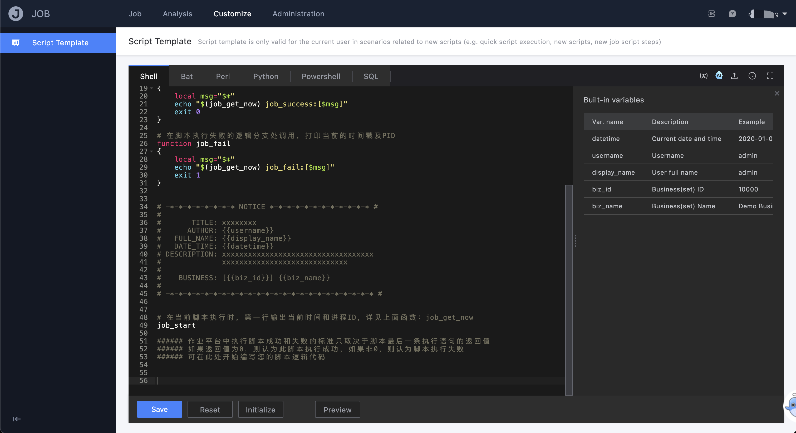

# Script template

The "script template" under the personalization module is to provide the ability to customize the default content of the script saved in the user dimension. For some users who have requirements such as script grammar writing specification and general variable precipitation, using this function can improve the efficiency of script usage .

