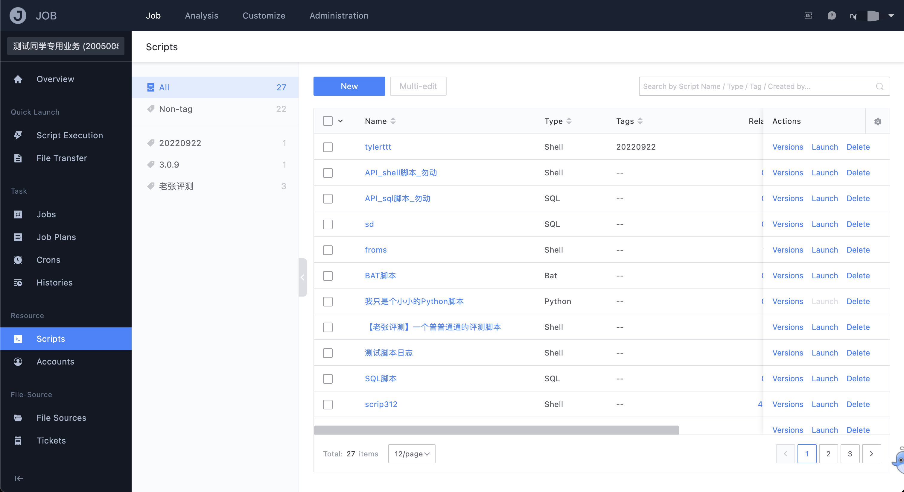
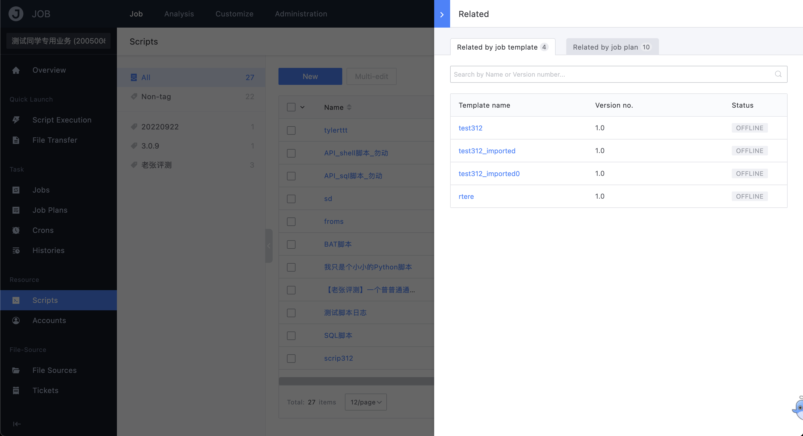
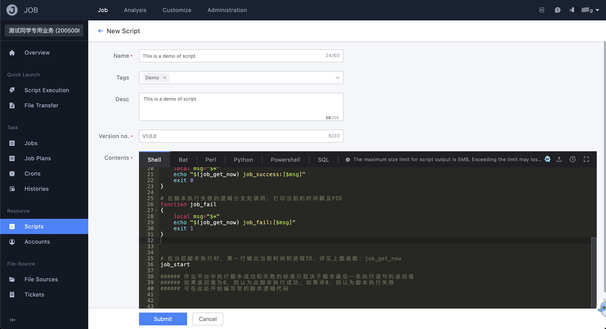
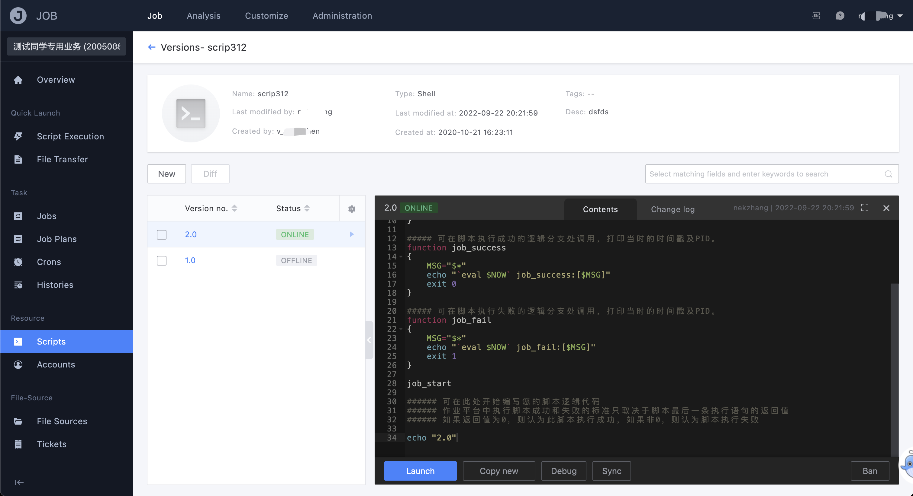
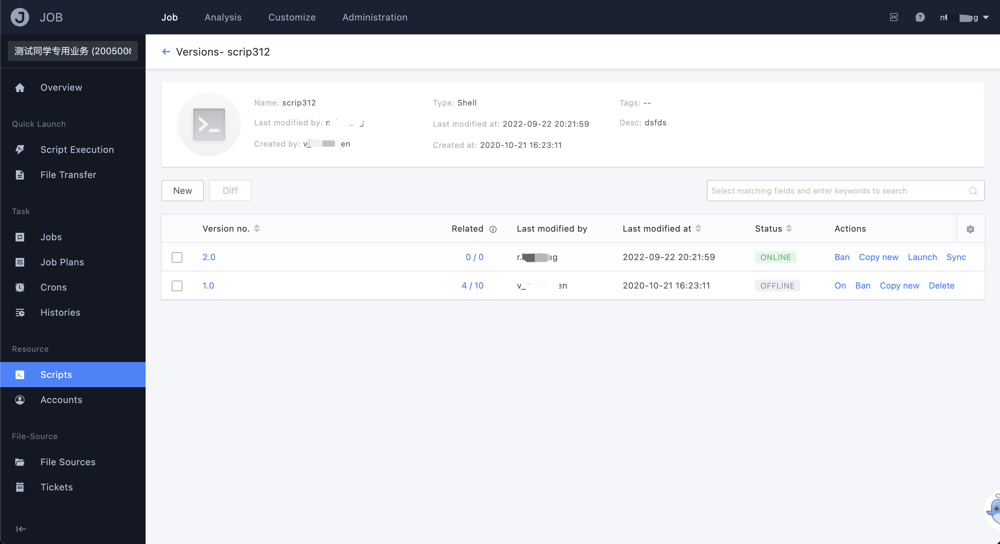

# Script management

"Script Management" provides functions for business management and maintenance of scripts, including script reference relationships, version logs, version log-off/comparison, etc.; this chapter introduces the relevant functions and logical relationships of script management.

## Reference relationship maintenance

You can choose to reference business scripts in the steps of the job template, so the referenced relationship of each script can be displayed in the "Referenced" column in the script list.

## New script

Enter the script creation page from the "New" button on the list page:

- script name

   Give the script a name that visually expresses its purpose

- scene label

   Tag classification of script usage scenarios (same as job tags)

- describe

   Script usage guidelines or detailed notes on function descriptions

- version number

   An identifier used to distinguish different versions of the script (similar to Github's version)

- script content

   Current version of the script content

After filling in the necessary parameters as required, click Submit to complete the creation of the new script:

## Version management of scripts

Version management provides functions such as creating/editing, going online/offline, disabling, code comparison and other functions to help users maintain many versions of scripts in an orderly manner.

- the status of the version

   - not online

     The newly created version is in this state by default and can be edited and modified repeatedly, which is equivalent to the draft state

   - is live

     The script can only be executed or referenced by jobs after it is online, and once the version is online, the new version number can only be cloned by copying and creating a new one

   - offline

     On the premise that there is already a version `offline`, clicking on another version to go online will set the original online version to `offline`, but it will not affect the referenced use

   - disabled

     When set to `disabled`, this version will not be available! Anything that has referenced this version online will be "unexecutable"! (security function)

- Version comparison

   After ticking any two versions, you can use this function to compare the code differences

   