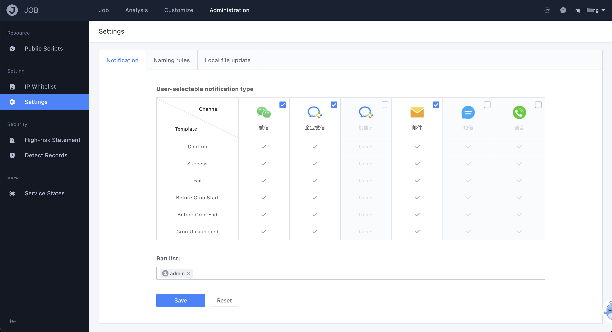
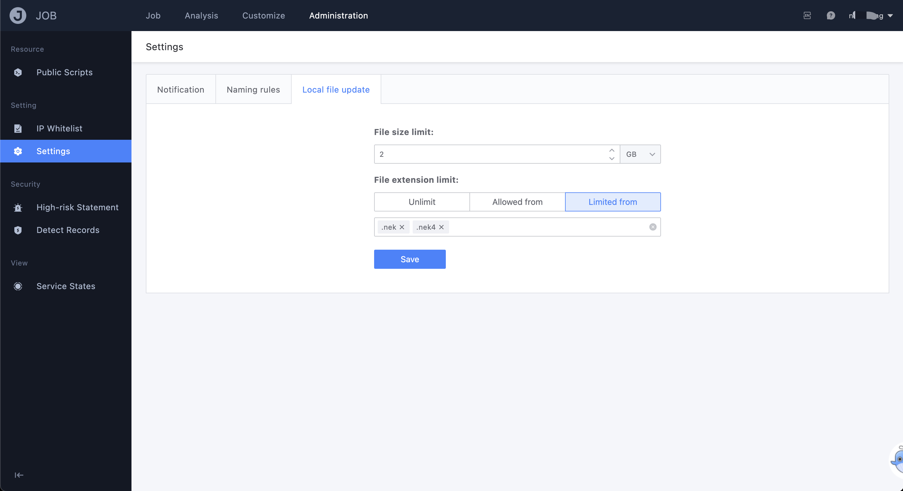

# Global Settings

The global settings provide management/maintenance functions for platform administrators. The core functions under this page are applicable to the entire platform, such as the optional message sending channels for all businesses in the platform, the historical data storage strategy of the operation platform, and so on. ..



- Notification settings

   Set all business/user optional message notification channels, templates and objects in the operation platform

   ```text
   The usage scenario of "communication blacklist": Every enterprise will have some high-level and special sensitive personnel who are not related to the business. In order to prevent business operation and maintenance from misconfiguring these sensitive users when setting the message notification object of the task, it is provided The blacklist function is used to avoid this kind of problem.
   ```

- Account naming rules

   Different companies may have special requirements for customization or specification of the OS. For example, company A has modified the Linux kernel and adjusted the account naming rules for useradd; To meet the scenario of the same function but different customization requirements, we provide the account naming rules to the enterprise operation platform administrators to customize the settings through page configurability.

   
  
- File upload settings

   Provide platform administrators with upper limit settings on the size of files uploaded locally on the client side

   