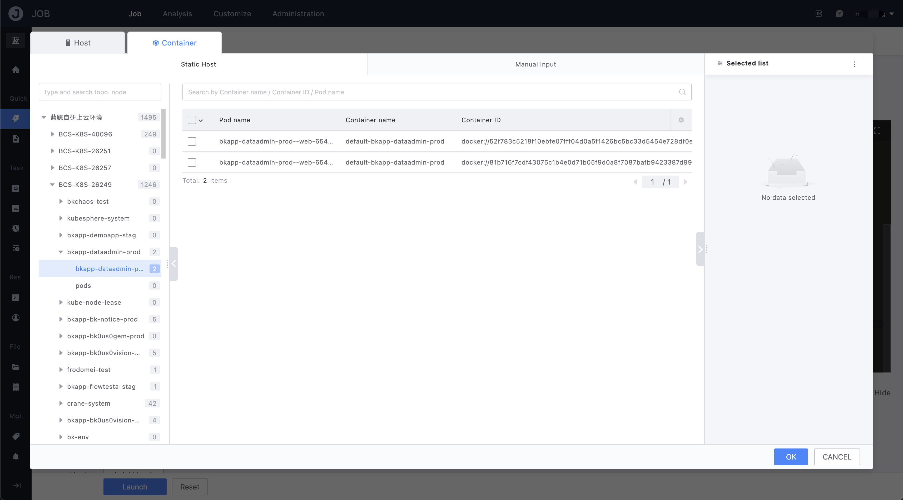
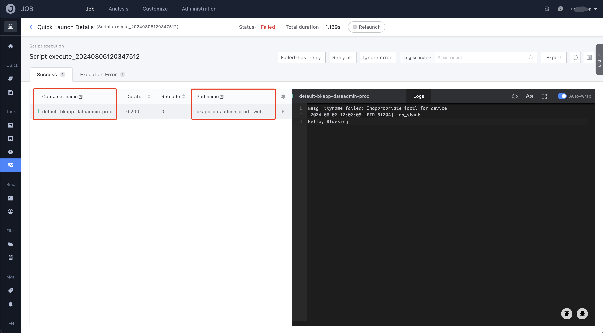

# Container Execution

The JOB supports operations on containers deployed on nodes of container clusters with GSE, including script execution and file distribution. Users can select and execute containers based on the `Cluster - Namespace - Workload - Pod` dimensions of the BCS.

The execution result page of the container also provides information about the Pod to which the container belongs, helping users to locate the execution target more quickly.

