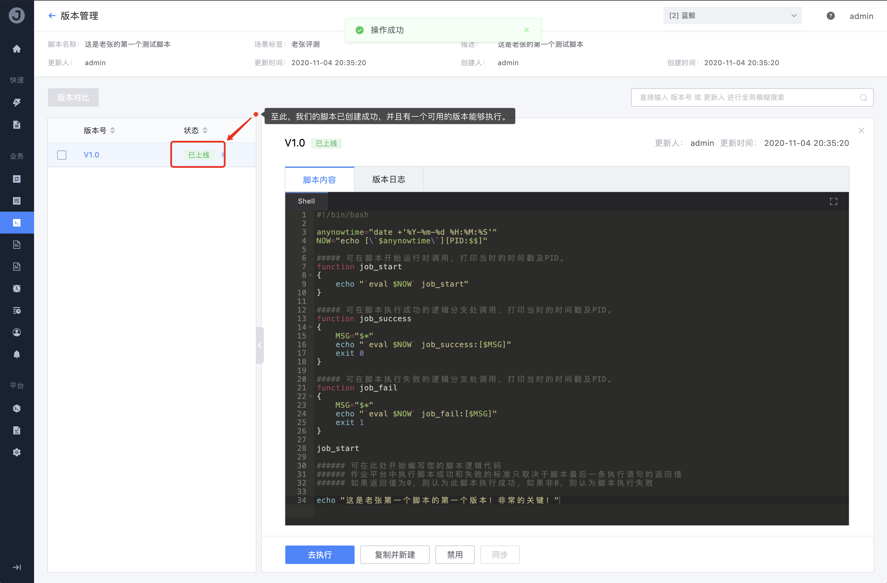

# 2. Create a script

## Preconditions

```text
none
```

## Steps

1. Go to the **Script Management** page, click the "New" button to enter

    

2. Follow the prompts on the page to fill in the complete script related content

    

3. Click Submit, the script is created

    

4. Click on the script name to enter to view the details of the script

    

5. Click the specific version number to enter to view the script content and version log of this version

    

    The script version management provides a version management function similar to SVN to help users effectively manage each version branch of the script; for the description of the meaning of each status of the version, please refer to the function introduction document of script management (Portal: [Script management function introduction] (../Features/Scripts.md)).

6. Set the version to "**Online**" status for our later testing

    